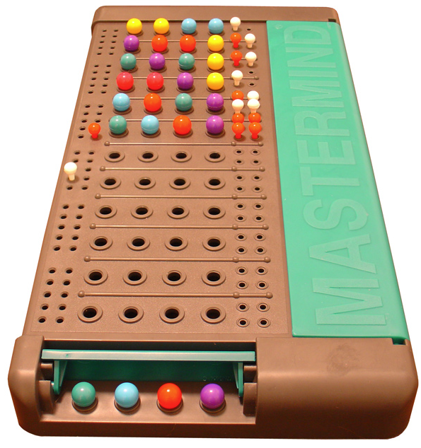

# Mina zkApp: Mina Mastermind Level 1



# Table of Contents

- This README is divided into two main sections: **Mastermind Game Documentation** and **General zkApp Documentation**.

  - **The Mastermind Game Documentation** is focused on the specific implementation of the Mastermind game as a zkApp example. This section details the game rules, the structure of the zkApp tailored for Mastermind, and the methods specific to this game.

  - **The General zkApp Documentation** provides broader information about zkApps, including their structure, security considerations, best practices, and relevant APIs. This section is applicable to any zkApp you might develop, not just the Mastermind game.

## Mastermind Game Documentation

- [Understanding the Mastermind Game](#understanding-the-mastermind-game)

  - [Overview](#overview)
  - [Game Rules](#game-rules)

- [Mastermind zkApp Structure](#mastermind-zkapp-structure)

  - [Mastermind States](#mastermind-states)
    - [maxAttempts](#maxattempts)
    - [turnCount](#turncount)
    - [codemasterId & codebreakerId](#codemasterid--codebreakerid)
    - [solutionHash](#solutionhash)
    - [unseparatedGuess](#unseparatedguess)
    - [serializedClue](#serializedclue)
    - [isSolved](#issolved)
  - [Mastermind Methods](#mastermind-methods)
    - [initGame](#initgame)
    - [createGame](#creategame)
    - [makeGuess](#makeguess)
    - [giveClue](#giveclue)

## General zkApp Documentation

- [Mina zkApp Structure](#mina-zkapp-strucuture)

  - [Introduction](#introduction)
  - [zkApp Components](#zkapp-components)
    - [States](#states)
    - [Methods](#methods)

- [Security Considerations](#security-considerations)

  - [Controlling Method Invocation Patterns](#controlling-method-invocation-patterns)
  - [Securing Method Access with Authorization Controls](#securing-method-access-with-authorization-controls)
  - [Rigorous Input Validation and State Verification](#rigorous-input-validation-and-state-verification)
  - [Safeguarding Private Inputs in zk-SNARK Circuits](#safeguarding-private-inputs-in-zk-snark-circuits)
  - [Preventing Underconstrained Proofs](#preventing-underconstrained-proofs)

- [Good Practices](#good-practices)

  - [Project Structure](#project-structure)
  - [Unit and Integration Tests](#unit-and-integration-tests)
  - [Provability](#provability)

- [API Explanation](#api-explanation)

  - [Benchmarking](#benchmarking)
    - [analyzeMethods](#analyzemethods)
    - [Provable.constraintSystem](#provableconstraintsystem)
  - [Provable.witness](#provablewitness)
  - [Provable.if](#provableif)
  - [Field vs { UInt8, UInt32, UInt64 }](#field-vs--uint8-uint32-uint64-)

- [How to Build & Test](#how-to-build--test)
  - [How to build](#how-to-build)
  - [How to run tests](#how-to-run-tests)
  - [How to run coverage](#how-to-run-coverage)
- [License](#license)

# Understanding the Mastermind Game

## Overview

- The game involves two players: a `Code Master` and a `Code Breaker`.
- Inspired by [mastermind-noir](https://github.com/vezenovm/mastermind-noir), this version replaces colored pegs with a combination of 4 unique, non-zero digits.

## Game Rules

- The Code Master hosts a game and sets a secret combination for the Code Breaker to guess.

- The Code Breaker makes a guess and waits for the Code Master to provide a clue.

- The clue indicates the following:

  - **Hits**: Digits that are correctly guessed and in the correct position.
  - **Blows**: Digits that are correct but in the wrong position.

  Example:

  |        | P1  | P2  | P3  | P4  |
  | ------ | --- | --- | --- | --- |
  | Secret | 5   | 9   | 3   | 4   |
  | Guess  | 5   | 7   | 8   | 9   |
  | Clue   | 2   | 0   | 0   | 1   |

  - Code Master's secret combination: **5 9 3 4**
  - Code Breaker's guess: **5 7 8 9**
  - Clue: **2 0 0 1**
    - Result: `1` hit and `1` blow.
      - The hit is `5` in the first position.
      - The blow is `9` in the fourth position.
      -

- The game continues with alternating guesses and clues until the Code Breaker achieves 4 hits and uncovers the secret combination or fails to do so within the **maximum allowed attempts**.

# Mastermind zkApp Structure

Following the game rules, the [MastermindZkApp](./src/Mastermind.ts) should be deployed:

- The zkApp is initialized by calling the `initGame` method, with `maxAttempts` as the method parameter to set an upper limit.

- After initialization, the Code Master calls the `createGame` method to start the game and set a secret combination for the Code Breaker to solve.

- The Code Breaker then makes a guess by calling the `makeGuess` method with a valid combination as an argument.

- The Code Master submits the solution again to be checked against the previous guess and provides a clue.

- The Code Breaker should analyze the given clue and make another meaningful guess.

- The game continues by alternating between `makeGuess` and `giveClue` methods until the Code Breaker either uncovers the secret combination or fails by exceeding the allowed `maxAttempts`, concluding the game.

Now, let's dive deeper into the states and methods of our Mastermind zkApp.

## Mastermind States

The Mastermind zkApp uses all 8 available states. Exceeding this limit would render the zkApp unusable, as it would surpass the maximum storage capacity.

Let's break down the purpose of each state and discuss the small workarounds used to minimize the number of states stored on-chain.

### maxAttempts

- This state is set during game initialization and is crucial for limiting the number of attempts in the game.

- Without this state, the game would be biased in favor of the Code Breaker, allowing the game to continue indefinitely until the secret combination is solved.

### turnCount

- This state is essential for tracking game progress. It helps determine when the maximum number of attempts (`maxAttempts`) has been reached and also identifies whose turn it is to make a move. If the `turnCount` is even, it's the Code Master's turn to give a clue; if it's odd, it's the Code Breaker's turn to make a guess.

### codemasterId & codebreakerId

- These states represent the unique identifiers of the players, which are stored as the **hash** of their `PublicKey`.

- We avoid storing the `PublicKey` directly because it occupies two fields. By hashing the `PublicKey`, we save two storage states, reducing the total required states from four to two.

- Player identifiers are crucial for correctly associating each method call with the appropriate player, such as linking `makeGuess` to the Code Breaker and `giveClue` to the Code Master.

- Restricting access to methods ensures that only the intended players can interact with the zkApp, preventing intruders from disrupting the 1 vs 1 interactive game.

### solutionHash

- The solution must remain private; otherwise, the game loses its purpose. Therefore, whenever the Code Master provides a clue, they should enter the `secretCombination` as a method parameter.

- To maintain the integrity of the solution, the solution is hashed and stored on-chain when the game is first created.

- Each time the Code Master calls the `giveClue` method, the entered private secret combination is salted, hashed, and compared against the `solutionHash` stored on-chain. This process ensures the integrity of the combination and helps prevent side-channel attacks.

- **Note:** Unlike player IDs, where hashing is used for data compression, here it is used to preserve the privacy of the on-chain state and to ensure the integrity of the values entered privately with each method call.

### unseparatedGuess

- This state represents the Code Breaker's guess as a single field encoded in decimal.
  - For example, if the guess is `4 5 2 3`, this state would be stored as a Field value of `4523`.
- The Code Master will later retrieve this value and separate it into the four individual digits to compare against the solution.

### serializedClue

- This state is a single field representing a clue, which is packed as a serialized value. A clue consists of four digits, each of which can be either `0`, `1`, or `2`, meaning the clue digits fall within the range of a 2-bit number. These digits are combined and stored on-chain as an 8-bit field in decimal.

- This state demonstrates a bit-serialization technique to compact multiple small field elements into one.

**Note:** To interpret the clue, the Code Breaker must deserialize and separate the clue digits to meaningfully understand the outcome of their previous guess.

### isSolved

This state is a `Bool` that indicates whether the Code Breaker has successfully uncovered the solution.

It is crucial for determining the end of the game, signaling completion once the Code Breaker achieves 4 hits within the allowed `maxAttempts`.

## Mastermind Methods

### initGame

**Note**: The `init()` method is predefined in the base `SmartContract` class, similar to a constructor.

- It is automatically called when you deploy your zkApp with the zkApp CLI for the first time.
- It is not called during contract upgrades or subsequent deployments.
- The base `init()` method initializes provable types like `Field`, `UInt8` to `0`, and the `Bool` type to `Bool(false)`, as it's a wrapper around a field with a value of `0`.
- Note that you cannot pass arguments to the `init` method of a `SmartContract`.

---

There are three variations for initializing a zkApp:

1. **All state initialized as `0` (no state with non-zero value):**

   - If you don't need to set any state to a non-zero value, there's no need to override `init()` or create a custom initialization method.
   - The base `init()` method will be automatically invoked when the zkApp is first deployed using the zkApp CLI.

2. **Initialize at least one state with a constant value:**

   - Override the `init()` method to initialize your on-chain state with constant values.
   - Include the base `init()` method's logic by calling `super.init()` to set all state variables to `0`.
   - Then, set the specific state variables to constant values, such as `Field(10)` or `Bool(true)`.
   - Example:

     ```ts
     class HelloWorld extends SmartContract {
       @state(Field) x = State<Field>();

       init() {
         super.init();
         this.x.set(Field(10)); // Set initial state to a constant value
       }
     }
     ```

3. **Initialize at least one state with a value dependent on an argument:**

   - Create a separate zkApp method with the adequate name
   - Within this method, call `super.init()` to initialize all state variables to `0`.
   - Use the method's parameters to set specific state variables based on the caller's input.
   - Example:

     ```ts
     class HelloWorld extends SmartContract {
       @state(Field) x = State<Field>();

       @method async initWorld(myValue: Field) {
         super.init();
         this.x.set(myValue); // Set initial state based on caller's input
       }
     }
     ```

**Notes:**

- In the Mastermind zkApp, we used the third variation to initialize the game, as it allows the caller to set the value of `maxAttempts`.

- In variations `1` and `2`, the `init()` method, whether default or overridden, is automatically executed when the zkApp is deployed. In contrast, the custom init method in the third variation must be called manually to initialize the states.

- Since the custom initialization method can be called by anyone at any time, refer to the [Security Considerations](#initialize-must-be-called-first-and-only-once) to ensure it is implemented securely.

---

### createGame

- This method should be called **after** initializing the game and **only once**.
- The method executes successfully when the following conditions are met:

  - The code master provides two arguments: `unseparatedSecretCombination` and a `salt`.

  - The `unseparatedSecretCombination` is split into an array of fields representing the four digits. An error is thrown if the number is not in the range of `1000` to `9999`.

  - The separated digits are validated to ensure they are unique and non-zero, with errors thrown if they do not meet these criteria.

  - The secret combination is then hashed with the salt and stored on-chain as `solutionHash`.

  - The caller's `PublicKey` is hashed and stored on-chain as `codemasterId` once the combination is validated.

  - Finally, the `turnCount` is incremented, signaling that the game is ready for the code breaker to `makeGuess`.
  - The first user to call this method with valid inputs will be designated as the code master.

**Note:** For simplicity, security checks in this method have been abstracted. For more details, please refer to the [Security Considerations](#safeguarding-private-inputs-in-zk-snark-circuits).

---

### makeGuess

- This method should be called directly after a game is created or when a clue is given for the previous guess.

- There are a few restrictions on calling this method to maintain a consistent progression of the game:

  - If the game `isSolved`, the method can be called, but it will throw an error.
  - If the code breaker exceeds the `maxAttempts`, the method can be called, but it will throw an error.
  - This method also enforces the correct sequence of player interactions by only allowing the code breaker to make a guess if the `turnCount` state is `odd`. If any of these conditions are not met, the method can be called, but it will throw an error.

- Special handling is required when the method is called for the first time:

  - The first player to call the method and make a guess will be registered as the code breaker for the remainder of the game.
  - The [Provable.if API](#provableif) is used to either set the current caller's `PublicKey` hash or fetch the registered code breaker ID.

- Once the `makeGuess` method is called successfully for the first time and a code breaker ID is registered, the method will restrict any caller except the registered one.

- After all the preceding checks pass, the code breaker's guess combination is validated, stored on-chain, and the `turnCount` is incremented. This then awaits the code master to read the guess and provide a clue.

---

### giveClue

- Similar to the `makeGuess` method, there are a few restrictions on calling this method to maintain a consistent progression of the game:

  - The caller is restricted to be only the registered code master ID.
  - The correct sequence is enforced by checking that `turnCount` is non-zero (to avoid colliding with the `createGame` method call) and even.
  - If the game `isSolved`, this method is blocked and cannot be executed.
  - If the code breaker exceeds the `maxAttempts`, this method is blocked and cannot be executed.

- After the preceding checks pass, the plain `unseparatedSecretCombination` input is separated into 4 digits, hashed along with the salt, and asserted against the `solutionHash` state to ensure the integrity of the secret.

- Next, the guess from the previous turn is fetched, separated, and compared against the secret combination digits to provide a clue:

  - If the clue results in 4 hits (e.g., `2 2 2 2`), the game is marked as solved, and the `isSolved` state is set to `Bool(true)`.
  - The clue is then serialized into `4` 2-bit Fields, packed as an 8-bit field in decimal, and stored on-chain.
  - Note that this technique requires the adversary to deserialize and correctly interpret the digits before making the next guess.

- Finally, the `turnCount` is incremented, making it odd and awaiting the code breaker to deserialize and read the clue before making a meaningful guess—assuming the game is not already solved or has not reached the maximum number of attempts.

---

# Mina zkApp Structure

## Introduction

- By the definition of a smart contract:

  > Smart contracts are digital contracts stored on a blockchain that are automatically executed when predetermined terms and conditions are met.

- zkApps are essentially smart contracts on the Mina blockchain that can undergo updates to their on-chain state through zero-knowledge proofs when certain `preconditions` are met.

- Specifically, a zkApp is an account on the Mina blockchain with a verification key and 8 storage states that can be updated following the successful verification of zero-knowledge proofs. These proofs dictate the logic for how these states are updated.

## zkApp components

As demonstrated in the [Mastermind zkApp](./src/Mastermind.ts), a zkApp primarily consists of a set of states (up to 8) and methods.

### States

- These are the 8 states associated with the zkApp account, stored on-chain.

- All zkApp states are **public**.

- A state creates a precondition that is checked when the proof is sent in a transaction to the blockchain to be verified.

  - This process occurs under the hood when using the following API:
    ```ts
    const currentState = this.num.get();
    this.num.requireEquals(currentState);
    ```
  - The first line of code retrieves the current state before the proof is generated.
  - The second line creates a precondition that is verified when the proof is submitted in a transaction to the blockchain.
  - This ensures that the transaction will fail if the value of the field has changed.

- Each state occupies **255 bits** in size.

- You can use other provable types like `Bool`, `UInt8`, etc., but even if they appear smaller in size, they still occupy a full 255-bit field element.

- Keep in mind that a [struct](https://docs.minaprotocol.com/zkapps/tutorials/common-types-and-functions#struct) can take up more than one Field.

  - For example, a `PublicKey` occupies two of the eight fields.

- A state is defined as follows:
  ```ts
  @state(Field) myState = State<Field>();
  ```

---

- **Note**: While the 8 on-chain states may be insufficient for some applications, there are workarounds using various techniques and APIs, which will be demonstrated in the upcoming advanced Mastermind Levels.

### Methods

- Interaction with a zkApp occurs through calling one or more of its methods.

- A method call **always** generates a proof that must be verified on-chain.

- A method can read on-chain data before generating a proof but can only trigger updates (write) after the transaction proof is successfully verified.

- All method parameters are **private**, and you can include any number of parameters you need.

- If we think of a method as a circuit:

  - The circuit's private inputs are the method parameters.
  - The circuit's public inputs are the on-chain states.
    - As in any ZK circuit, the public inputs can be derived from or committed to by the private inputs. Additionally, state preconditions commit to the transaction proof, not necessarily to the private inputs of a method.
    - The zkApp's on-chain states are fetched before the proof is generated.
    - The method call also sets preconditions on the on-chain state:
      - A precondition ensures that a specific condition (equality, greater than, less than, etc.) at the time the state was read for proof generation is still satisfied when the proof is verified on-chain.
      - This guarantees correct execution and prevents race conditions during state updates.

- Within a method, you can use o1js data types and primitives to define your custom logic.

  - For more details, refer to this guide on [methods](https://docs.minaprotocol.com/zkapps/writing-a-zkapp/introduction-to-zkapps/smart-contracts#methods).

- A method call does **not** just submit a proof for verification but can also read data from the blockchain and perform actions like updating on-chain states, emitting events, and dispatching actions.

- You can declare methods using the `@method` decorator as follows:

  ```ts
  @method async myMethod(secret: Field) {...}
  ```

- A zkApp `init method` is quite an exception, for a comprehensive guide on initializing a zkApp, refer to the [Mastermind initGame documentation](#initgame).

# Security Considerations

To ensure that a zkApp operates securely and avoids unintended behavior, it is crucial to implement comprehensive security measures that enforce trustless and consistent operation.

When developing a zkApp, various security checks should be incorporated, including access control mechanisms similar to `modifiers` in Solidity, input validation, and specific safeguards related to zk-SNARK circuits.

Key security considerations include:

## Controlling Method Invocation Patterns

- It's crucial to establish strict rules for the order and frequency of method calls to prevent unauthorized sequences or excessive invocation. This ensures that the zkApp’s logic is executed in a controlled and predictable manner, reducing the risk of exploitation.

### Initialize: Must Be Called First and Only Once

- For the [initGame method](#initgame), it's essential to ensure that this method is called immediately after deployment, with no other methods executed beforehand.

- Additionally, we must enforce that this method is called **only once**.

  - If the game is in progress and someone calls the method to reset the game, it could be catastrophic.

- To restrict the sequence and frequency of calling this method, we use the following API:

  ```ts
  const isInitialized = this.account.provedState.getAndRequireEquals();
  isInitialized.assertFalse('The game has already been initialized!');
  ```

  - By asserting that `provedState` is `false`, you ensure that `initGame` cannot be called again after the zkApp is initially set up. Without this assertion, your zkApp could be reset by anyone calling the init method.

  - It's also crucial that **all** other methods assert that `provedState` is `true` to ensure the zkApp has been properly initialized, as `provedState` becomes `true` after `initGame` is invoked.

### Enforce Method Call Once in a Specific Sequence

For the `createGame` method, we need to ensure that a player can call this method **only once after the game is initialized** and before any other methods are executed.

- To enforce this restriction, we use an on-chain variable called `turnCount`.
  - `turnCount` is initialized to `0`, and in other methods, every player action increments this count.
  - Therefore, we assert that `turnCount` is `zero` to confirm that no other method was called before `createGame`.
  ```ts
  turnCount.assertEquals(0, 'A mastermind game is already created!');
  ```

## Securing Method Access with Authorization Controls

- It's crucial to have robust authorization mechanisms to restrict access to sensitive methods. This ensures that only verified and authorized entities can execute critical functions within the zkApp, protecting it from unauthorized use.

In the case of our Mastermind zkApp, it's essential to limit method access to the code master and the code breaker. Otherwise, anyone could access the zkApp and disrupt the game flow.

Generally, as seen in the [codemasterId & codebreakerId states](#codemasterid--codebreakerid), the check involves storing the method caller ID, typically by hashing their `PublicKey`, and asserting that the caller is authorized to execute the method.

For example:

```ts
// Generate codemaster ID
const computedCodemasterId = Poseidon.hash(
  this.sender.getAndRequireSignature().toFields()
);

//! Restrict method access solely to the correct codemaster
this.codemasterId
  .getAndRequireEquals()
  .assertEquals(
    computedCodemasterId,
    'Only the codemaster of this game is allowed to give clue!'
  );
```

**Notes:**

- This logic works well in the game since it doesn't require much state. However, if we need to authorize a large number of users, it could become problematic due to the limited `8` states of storage available.

- To learn more about scaling data storage, including off-chain storage, actions/reducers, or other packing techniques, follow the next levels of this game and explore the relevant APIs in the o1js library.

## Rigorous Input Validation and State Verification

- Enforce stringent validation of all inputs and verify the integrity of the on-chain state before executing any dependent logic. This prevents invalid or malicious data from affecting the zkApp’s operations, maintaining overall security and correctness.

- Validate inputs and on-chain state for correctness by checking value ranges, enforcing equality, and applying necessary conditions.

- For example, in the case of the `maxAttempts` state, it’s useful to allow flexibility in setting the number of attempts. However, an unrestricted range could be manipulated—small values like `0` to `4` would favor the Code Master by giving fewer chances to the Code Breaker, while larger values would do the opposite. Therefore, it’s important to assert that the `maxAttempts` state falls within a reasonable range, such as `5` to `20`, to ensure a balanced game.

For example:

```ts
maxAttempts.assertGreaterThanOrEqual(
  UInt8.from(5),
  'The minimum number of attempts allowed is 5!'
);

maxAttempts.assertLessThanOrEqual(
  UInt8.from(15),
  'The maximum number of attempts allowed is 15!'
);
```

## Safeguarding Private Inputs in zk-SNARK Circuits

- Protect sensitive input data by ensuring that it remains confidential within the zk-SNARK circuit. It's critical to verify inputs without exposing their values, thereby preventing data leaks or manipulation.

- Protect the security of private inputs by securely committing them as state hashes, ensuring they cannot be manipulated or exposed.

- For example:

  - Since the combination in a Mastermind game is a 4-digit number, it could inadvertently disclose information about the `solutionHash`, as state updates are publicly stored on the Mina blockchain and could be easily brute-forced.

- To enhance security, a salt (random field) is introduced to the hash input: `hash(secret, salt)`. This adds approximately `255` bits of security, making it astronomically difficult to uncover the original input through brute force.

- However, while the use of salt increases security, it also adds complexity in debugging, as it becomes more difficult to trace errors related to the hash. The hash now varies with each change in the secret or the salt, making it harder to pinpoint the source of issues.

## Preventing Underconstrained Proofs

- Prevent vulnerabilities by ensuring that all provable code within the zk-SNARK circuit is fully constrained. This avoids the creation of underconstrained proofs, which could otherwise lead to security breaches or unintended behavior.
- It's crucial to properly constrain the provable code by using assertions.

  - For example, the API `Field.equals(2)` is not the same as `Field.assertEquals(2)`. The former returns a `Bool`, while the latter adds a constraint on the equality and will cause proof generation and verification to fail if the equality check fails.
  - The same applies to other comparisons and checks, such as `greaterThan`, `lessThan`, etc.

- Be cautious when using the `Provable.witness` API. Ensure that its output is consistently constrained, operating based on another field or variable.
  - Please refer to the API documentation [here](#provablewitness) for more details.

---

> Note that the security considerations documented here are specific to the Mastermind game. For more details on zkApp security considerations, please refer to this excellent guide on [Security and zkApps](https://docs.minaprotocol.com/zkapps/writing-a-zkapp/introduction-to-zkapps/secure-zkapps).

# Good practices

## Project Structure

- Unlike other zkDSLs, the `o1js` SDK handles both circuit writing for the zkApp as well as interacting with the blockchain, whether for deployment or interaction.

  - At times, it can be confusing to distinguish between these functionalities within the zkApp. To address this, it’s a good practice to shift provable code (i.e., the code that defines the zk-SNARK circuits) to a separate file(s).

  - Separating the circuit code into its own file is beneficial for testing purposes. By isolating the main circuit "templates," you can unit test them separately, ensuring that the core logic is sound before integrating it into the larger zkApp. This modular approach improves maintainability and makes it easier to debug and verify the circuit logic independently.

  - This approach enhances readability and keeps the zkApp file less bloated, allowing it to focus more on the blockchain interaction logic. This makes the zkApp resemble a traditional smart contract, where the primary concern is handling transactions and state changes on the blockchain.

---

The `MastermindZkApp` project is organized to enhance clarity, maintainability, and ease of testing. Key files include:

```sh
src/
├── index.ts
├── Mastermind.test.ts
├── Mastermind.ts
├── utils.test.ts
└── utils.ts
```

- **`index.ts`**: Serves as the entry point, importing and exporting all essential smart contract classes for the zkApp(s).

- **`utils.ts`**: Contains reusable utility functions that act as standalone `circuit templates`. By isolating these logic components, the main zkApp code remains focused and uncluttered.

- **`utils.test.ts`**: Provides unit tests for the functions in `utils.ts`, ensuring each logic component works correctly before integration into the zkApp. This helps catch issues early and improves overall reliability.

- **`Mastermind.ts`**: The core file where the game logic and blockchain interactions are defined. This ensures that the zkApp's mechanics and state management are clear and maintainable.

- **`Mastermind.test.ts`**: Contains integration tests using a `localBlockchain`. These tests validate the zkApp’s behavior in various scenarios, ensuring it functions correctly and securely in a simulated environment.

- **Note**: Files that contain zkApp code and their test files typically start with an uppercase letter, such as `Mastermind.ts`. This convention aids in distinguishing and navigating the codebase more easily.

## Unit and Integration Tests

- It’s best practice to separate unit tests, which focus on testing the logic of individual zkApp components, from integration tests, which evaluate the zkApp as a whole, interacting with a `localBlockchain` environment.

- In both unit and integration tests, consider an adversarial environment. Test both the happy and unhappy paths, ensuring that all assumptions about trust and security within the zkApp are validated.

- Integration tests serve as an additional check, not only for the zkApp’s overall functionality but also indirectly validating the utility components tested in unit tests.

- Begin testing your zkApp on a `localBlockchain` as it is faster and requires less setup (e.g., keys, deployment). After thorough local testing, deploy it on devnet to interact with it in an environment similar to mainnet and track transactions using Mina Scan.

- For code examples:

  - Refer to the Mastermind game [integration tests](./src/Mastermind.test.ts) for integration test examples.
  - Refer to the Mastermind zkApp’s [unit tests](./src/utils.test.ts) for examples of testing the logic components.

- For more details, refer to the documentation on [Testing zkApps Locally](https://docs.minaprotocol.com/zkapps/writing-a-zkapp/introduction-to-zkapps/testing-zkapps-locally).

### Notes

- Integration tests not only evaluate the behavior and interactions of a zkApp but also validate that the provable code is consistent.

  - For example, if you use the `.toBigInt()` method to convert a `Field` to `bigint` within a zkApp method, the tests will fail and throw an error if the "circuit" is not provable. If nothing happens, it means the circuit is provable.

- When running integration tests, you can choose whether to generate proofs:

  - To generate proofs when sending a transaction to the [local blockchain](https://docs.minaprotocol.com/zkapps/writing-a-zkapp/introduction-to-zkapps/testing-zkapps-locally#creating-a-simulated-local-blockchain):

    ```ts
    let proofsEnabled = true;
    if (proofsEnabled) await MastermindZkApp.compile();

    // Set up the Mina local blockchain
    const Local = await Mina.LocalBlockchain({ proofsEnabled });
    Mina.setActiveInstance(Local);
    ```

- Note that when `proofsEnabled = true`, test execution will be slower since proof generation takes time.

  - This provides a more realistic simulation of how transactions work on the Mina blockchain.

  - You don’t need to generate proofs for every test run; enable it occasionally for deeper checks, but keep it disabled for faster test execution.

## Provability

- In tests, you may notice that certain provable functions, like `combineDigits`, can be used as regular TypeScript functions, or some field states converted to JS/TS types such as `bigint`.

- However, it's important to note that provable code outside a provable environment (e.g., `zkApp` or `zkProgram`) behaves like standard TypeScript code.

- This conversion is valid when moving from a provable to a non-provable environment, such as during testing, but not the other way around.

- To migrate non-provable code into a provable environment (`zkApp` or `zkProgram`), you must use the `Provable.witness()` API **and** properly constrain the operation, as detailed in the [documentation](#provablewitness).

- **Validating Provable Code:**

  - To ensure that your provable code is indeed valid within a provable environment, you can run integration tests as setting up a Mina blockchain instance and executing your zkApp methods inherently validates their provability.

  - However, if you need to validate smaller components separately, the `constraintSystem` API can be utilized to check provability and view the specific rows/constraints for your code using the o1js API.
  - For more details, refer to the [constraintSystem documentation](#provableconstraintsystem).

# API Explanation

## Benchmarking

In the Kimchi proof system, the circuit size is constrained by a limit of `2^16` or `65,536` rows.

Understanding the number of rows for each of your method circuits (i.e., the number of constraints in the underlying proof system) is crucial, as it serves as a good indicator of circuit size and the time required to generate proofs.

Additionally, the following APIs can be used as quick checks to ensure that your contract compiles without errors, significantly speeding up the iteration process.

### analyzeMethods

- Both `zkApp` and `zkProgram` have a method called `analyzeMethods` that returns an object, keyed by method name, with each entry containing:

  - **rows:** the size of the constraint system created by this method.
  - **digest:** a digest of the method circuit.
  - **actions:** the number of actions the method dispatches.
  - **gates:** the constraint system, represented as an array of gates.

- For example, you can check the `MastermindZkApp` method summaries as follows:

  ```ts
  import { MastermindZkApp } from './Mastermind.js';
  console.log(await MastermindZkApp.analyzeMethods());
  ```

### Provable.constraintSystem

- You can effectively verify whether your provable code compiles without errors and streamline the development process by analyzing smaller functions or components within your zkApp/zkProgram.

- The `Provable.constraintSystem` function, although similar to `analyzeMethods`, is specifically designed for benchmarking the logic within an individual callback. This enables you to profile and understand the constraints of specific components in your zkApp/zkProgram.

- It generates a circuit summary akin to analyzeMethods, but it specifically targets the execution of the provable callback and provides a detailed summary of its constraints.

- Here’s a code snippet demonstrating its usage:

  ```ts
  let boundCS = await Provable.constraintSystem(() => {
    const anyField = Provable.witness(Field, () => Field(1001));

    const lowerBound = anyField.greaterThanOrEqual(1000);
    const upperBound = anyField.lessThanOrEqual(9999);
    lowerBound.and(upperBound).assertTrue();
  });

  console.log(boundCS);
  ```

  - The callback in `Provable.constraintSystem` simulates a circuit within the proof system environment. It's critical to use the `Provable.witness` API to define circuit inputs for this quick-to-run provable code.

  - When witnessing an input, as in `const anyField = Provable.witness(Field, () => Field(1001));`, the value serves as a placeholder for a circuit input argument. The actual value is not relevant to the benchmarks but is necessary to establish the circuit inputs.

  - If no input is witnessed with `Provable.witness`, the summary will display `0` constraints, leading to meaningless benchmarks.

## Provable.witness

Based on the API JSDoc documentation:

> Create a new witness. A witness, or variable, is a value provided as input by the prover. This offers a flexible way to introduce values from outside into the circuit. However, note that nothing about how the value was created is part of the proof—`Provable.witness` behaves exactly like user input. So, ensure that after receiving the witness, you make any necessary assertions associated with it.

### When to Use

- `Provable.witness` is an API similar to the single arrow `<--` in Circom.

- `Provable.witness` follows the pattern: `compute, then constrain`.

- Some operations are extremely difficult to model with pure constraints alone. In these cases, it may be necessary to shift an expensive or complicated computation outside the circuit and prove the integrity of that computation by adding adequate constraints.

- In summary, `Provable.witness` is useful for optimizing circuit constraints or working around complex operations that are challenging to model when writing a circuit.

### Security Warning

- `Provable.witness` can be a potential pitfall and lead to underconstraints.

- Underconstraints are a significant source of security bugs in zero-knowledge applications, so triple-check that the constraints are generated as expected!

### How to Use

- `Provable.witness` is used by defining the type of the output and a callback that allows non-provable code and returns the same type defined earlier.

  - Note that if you want to witness an array of provable elements, you need to use the `Provable.Array` API.

  - For example:

    ```ts
    // Witness the individual digits of the combination
    const digits = Provable.witness(Provable.Array(Field, 4), () => {
      const num = combination.toBigInt();
      return [num / 1000n, (num / 100n) % 10n, (num / 10n) % 10n, num % 10n];
    });

    // Assert the correctness of the witnessed digit separation
    compressCombinationDigits(digits).assertEquals(combination);
    ```

  - Note that the type is inferred from the type entry, and there was no need to use `.map(Field)`.

- `Provable.witness` behaves like user input but can only return deterministic circuit values. In other words, it cannot replace a circuit input, as this input is only known when a user provides it.

  - For example:

    ```ts
    const myField = Provable.witness(Field, () => Field(10));
    ```

  - The snippet above is somewhat redundant because you could directly use `const myField = Field(10);`, but it becomes useful within the `Provable.constraintSystem` API, where it simulates a circuit input to generate a circuit summary or benchmarks for provable code.

  - Generally, `Provable.witness` is most useful when proving statements about another circuit variable for better efficiency and flexibility.

  - For example, division is expensive when operating on field elements, so a workaround is:

    ```ts
    @method async divideBy19(input: Field) {
      const result = Provable.witness(Field, () => {
        return input.toBigInt() / 19n;
      });

      // This constraint asserts that `input` is divisible by 19
      // and that `result` is correctly computed from `input`
      result.mul(19).assertEquals(input);
    }
    ```

  - The code snippet above, for example, costs only `1` constraint, whereas a similar computation with a division API would cost `10`.

## Provable.if

- `Provable.if` functions similarly to the ternary operator in JavaScript, allowing you to choose between two values based on a `Boolean` condition.

- In the example below, `Provable.if` selects `Field(10)` if the `Bool` condition is `true`, and `Field(15)` if it's `false`:

  ```ts
  const selector = Bool(true);
  const selected = Provable.if(selector, Field(10), Field(15));
  ```

- The arms of `Provable.if` can be any value or function that returns a value.

- Unlike JavaScript's conditional statements, `Provable.if` does not bypass the execution of one branch based on the condition. Due to the deterministic nature of zk-SNARK circuits, `Provable.if` evaluates both branches but only returns the value corresponding to the `Bool` condition.

- **Caution:** Since both branches are always executed, if either branch contains code that throws an error, `Provable.if` will trigger that error. This behavior contrasts with traditional JavaScript control flow, where only the executed branch of an `if/else` statement is evaluated.

For more details, refer to the [Control Flow](https://docs.minaprotocol.com/zkapps/tutorials/common-types-and-functions#control-flow) section in the o1js documentation.

## Field vs { UInt8, UInt32, UInt64 }

- The `UInt` types impose size constraints on fields.

  - For example, the `UInt8` provable type restricts the field size to a single byte, allowing values in the range of `0` to `255`.
  - Any value assigned to `UInt8` that falls outside this range will trigger an error, ensuring that only valid values are used.
  - You can convert a `UInt` type back to a `Field` provable type:
    ```ts
    const byte = UInt8.from(12);
    const byteField = byte.value;
    ```
  - Converting a `Field` to a `UInt8` is possible but can be unsafe if the value exceeds the `UInt8` range, leading to overflow:
    ```ts
    const smallField = Field(12);
    const byte = UInt8.Unsafe.fromField(smallField);
    ```

- `UInt` provable types come with specialized methods, such as `divMod`, which facilitate various operations. These methods are specifically tailored for the `UInt` types, making them essential in cases where precise, bounded operations are required.

- Under the hood, `UInt` types utilize custom gates that are **more efficient for range checks**.

  - `UInt` types not only limit the field size but also offer optimized constraint handling for operations on small-sized fields.
  - For instance, in the [constraintSystem example](#provableconstraintsystem), a range check on a `Field` type consumes only `56` rows, while performing a similar operation on a `UInt32` would cost only `10` rows.

  ```ts
  let bench32 = await Provable.constraintSystem(() => {
    const anyUInt32 = Provable.witness(UInt32, () => UInt32.from(1001));
    const lowerBound = anyUInt32.greaterThanOrEqual(UInt32.from(1000));
    const upperBound = anyUInt32.lessThanOrEqual(UInt32.from(9999));
    lowerBound.and(upperBound).assertTrue();
  });

  console.log('bound 32:', bench32);
  ```

---

For more details refer to the [o1js documentation](https://docs.minaprotocol.com/zkapps/o1js)

# How to Build & Test

## How to build

```sh
npm run build
```

## How to run tests

```sh
npm run test
npm run testw # watch mode
```

## How to run coverage

```sh
npm run coverage
```

# License

[Apache-2.0](LICENSE)
