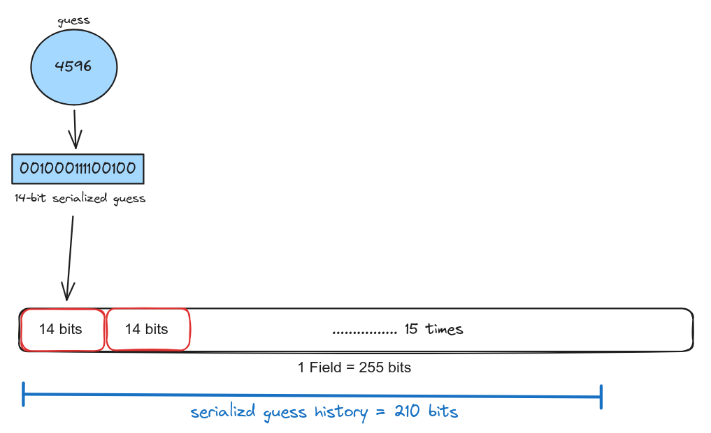
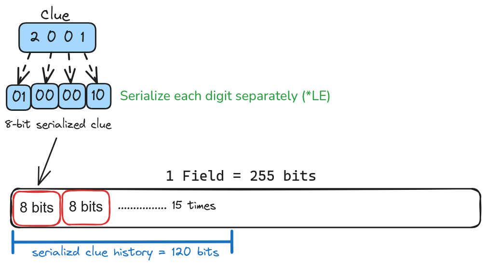

# Mina zkApp: Mina Mastermind


# Table of Contents

## Mastermind Game Documentation

- [Understanding the Mastermind Game](#understanding-the-mastermind-game)

  - [Overview](#overview)
  - [Game Rules](#game-rules)

- [Introduction](#introduction)
- [Motivation](#motivation)

- [Mastermind zkApp Structure](#mastermind-zkapp-structure)

  - [Mastermind States](#mastermind-states)
    - [maxAttempts](#maxattempts)
    - [turnCount](#turncount)
    - [isSolved](#issolved)
    - [codemasterId & codebreakerId](#codemasterid--codebreakerid)
    - [solutionHash](#solutionhash)
    - [packedGuessHistory](#packedguesshistory)
    - [packedClueHistory](#packedcluehistory)
  - [Mastermind Methods](#mastermind-methods)
    - [initGame](#initgame)
    - [createGame](#creategame)
    - [makeGuess](#makeguess)
    - [giveClue](#giveclue)

- [How to Build & Test](#how-to-build--test)
  - [How to build](#how-to-build)
  - [How to run tests](#how-to-run-tests)
  - [How to run coverage](#how-to-run-coverage)
- [License](#license)

# Understanding the Mastermind Game

## Overview

- The game involves two players: a `Code Master` and a `Code Breaker`.
- Inspired by [mastermind-noir](https://github.com/vezenovm/mastermind-noir), this version replaces colored pegs with a combination of 4 unique, non-zero digits.

## Game Rules

- The Code Master hosts a game and sets a secret combination for the Code Breaker to guess.

- The Code Breaker makes a guess and waits for the Code Master to provide a clue.

- The clue indicates the following:

  - **Hits**: Digits that are correctly guessed and in the correct position.
  - **Blows**: Digits that are correct but in the wrong position.

  Example:

  |        | P1  | P2  | P3  | P4  |
  | ------ | --- | --- | --- | --- |
  | Secret | 5   | 9   | 3   | 4   |
  | Guess  | 5   | 7   | 8   | 9   |
  | Clue   | 2   | 0   | 0   | 1   |

  - Code Master's secret combination: **5 9 3 4**
  - Code Breaker's guess: **5 7 8 9**
  - Clue: **2 0 0 1**
    - Result: `1` hit and `1` blow.
      - The hit is `5` in the first position.
      - The blow is `9` in the fourth position.
      -

- The game continues with alternating guesses and clues until the Code Breaker achieves 4 hits and uncovers the secret combination or fails to do so within the **maximum allowed attempts**.

# Introduction

This implementation is part of a multi-level series of the Mastermind zkApp game. It represents Level 2, which introduces packing techniques to efficiently store the history of actions for both the Code Master and the Code Breaker. Additionally, it incorporates dynamic array indexing and updates to retrieve and modify elements within lists, specifically in the context of zero-knowledge proof (ZKP) circuits.

- For a foundational understanding of the game, as well as insights into the enhancements introduced in Level 2, please refer to the [Mastermind Level 1](https://github.com/o1-labs-XT/mastermind-zkApp/tree/level1?tab=readme-ov-file) code and documentation.

- **Note**: Level 1 also includes a [General zkApp Documentation](https://github.com/o1-labs-XT/mastermind-zkApp/tree/level1?tab=readme-ov-file#general-zkapp-documentation), which covers key concepts related to zkApp development, along with details and APIs that are beyond the scope of this documentation.

# Motivation

- In the Level 1 implementation, both the [`unseparatedGuess` and `serializedClue` states](https://github.com/o1-labs-XT/mastermind-zkApp/blob/level1/src/Mastermind.ts#L27-L28) represent only a single guess and clue at a time.

  - While functional, this approach introduces the potential for errors, as it requires both players to manually track the history of the game.

  - Any mistake or oversight, particularly by the Code Breaker, could compromise their strategy, as the player must consider all prior clues to make informed guesses in subsequent turns.

  - Typically, the application frontend (not part of this project) would display the game's history and progress to both players. However, since no live record is stored on-chain, this setup relies on trust that the frontend will accurately represent the game state without tampering.

  - Although a player may recognize inconsistencies based on their memory of previous moves, relying on trust in frontend code (instead of an on-chain record) undermines the trustless nature of the game.

  - The goal of the Level 2 implementation is to overcome the zkApp’s 8-state storage limit by storing the history of guesses and clues directly on-chain. This eliminates the need for trust in off-chain tracking and reduces the risk of player errors, ensuring a more reliable and trustless gameplay experience.

- Since the size of individual states (guesses and clues) is small, a practical solution is to pack multiple small states into a single storage state. This is feasible, as each storage state in zkApps is 255 bits.

- The packing techniques introduced in this implementation can be applied beyond the game, serving as an efficient method to pack any list of small field elements into a single state, optimizing storage or for **encoding purposes**.

- Additionally, following the logic of the [giveClue method](#giveclue), which relies on the most recent guess stored on-chain, this implementation demonstrates dynamic indexing and updating of field arrays to retrieve the latest guess based on the [turnCount state](#turncount).

  - These techniques are not limited to this game and can be applied in other contexts when the index is a provable type, such as a `Field`.

---

- Dive deeper to explore the innovative techniques and architectural choices that showcase this level advancement in the game’s design.

# Mastermind zkApp Structure

Following the game rules, the [MastermindZkApp](./src/Mastermind.ts) should be deployed:

- The zkApp is initialized by calling the `initGame` method, with `maxAttempts` as the method parameter to set an upper limit.

- After initialization, the Code Master calls the `createGame` method to start the game and set a secret combination for the Code Breaker to solve.

- The Code Breaker then makes a guess by calling the `makeGuess` method with a valid combination as an argument.

- The Code Master submits the solution again to be checked against the previous guess and provides a clue.

- The Code Breaker should analyze the given clue and make another meaningful guess.

- The game continues by alternating between `makeGuess` and `giveClue` methods until the Code Breaker either uncovers the secret combination or fails by exceeding the allowed `maxAttempts`, concluding the game.

Now, let's dive deeper into the states and methods of our Mastermind zkApp.

## Mastermind States

The Mastermind zkApp utilizes all 8 available states, staying within the maximum storage capacity to ensure smooth functionality.

Let’s explore the purpose of each state and the clever workarounds employed to optimize on-chain storage and minimize state usage.

### maxAttempts

- This state is set during game initialization and is crucial for limiting the number of attempts in the game.

- Without this state, the game would be biased in favor of the Code Breaker, allowing the game to continue indefinitely until the secret combination is solved.

### turnCount

- This state is essential for tracking game progress. It helps determine when the maximum number of attempts (`maxAttempts`) has been reached and also identifies whose turn it is to make a move. If the `turnCount` is even, it's the Code Master's turn to give a clue; if it's odd, it's the Code Breaker's turn to make a guess.

### codemasterId & codebreakerId

- These states represent the unique identifiers of the players, which are stored as the **hash** of their `PublicKey`.

- We avoid storing the `PublicKey` directly because it occupies two fields. By hashing the `PublicKey`, we save two storage states, reducing the total required states from four to two.

- Player identifiers are crucial for correctly associating each method call with the appropriate player, such as linking `makeGuess` to the Code Breaker and `giveClue` to the Code Master.

- Restricting access to methods ensures that only the intended players can interact with the zkApp, preventing intruders from disrupting the 1 vs 1 interactive game.

### solutionHash

- The solution must remain private; otherwise, the game loses its purpose. Therefore, whenever the Code Master provides a clue, they should enter the `secretCombination` as a method parameter.

- To maintain the integrity of the solution, the solution is hashed and stored on-chain when the game is first created.

- Each time the Code Master calls the `giveClue` method, the entered private secret combination is salted, hashed, and compared against the `solutionHash` stored on-chain. This process ensures the integrity of the combination and helps prevent side-channel attacks.

- **Note:** Unlike player IDs, where hashing is used for data compression, here it is used to preserve the privacy of the on-chain state and to ensure the integrity of the values entered privately with each method call.

### packedGuessHistory

- This state represents the history of guesses made by the Code Breaker, serialized and packed into a single `Field` element.

- It not only plays a role in storing the history of the game but also serves as a means for the Code Master to provide clues based on the latest guess.

- The latest guess is retrieved within the zkApp's [giveClue method](#giveclue) by unpacking the guesses and indexing the most recent one based on the [turnCount state](#turncount).

- After deserializing and fetching the correct guess, the guess represents the Code Breaker's move as a single `Field` encoded in decimal.
  - For example, if the guess is `4 5 2 3`, it would be used as a `Field` value of `4523`.
- The Code Master will later split it into its individual digits to compare against the solution.

- For more details on the packing/unpacking architecture used for operations on `packedGuessHistory`, refer to the [makeGuess method](#makeguess) documentation.

### packedClueHistory

- This state represents the history of clues provided by the Code Master.
- Unlike [packedGuessHistory](#packedguesshistory), this state is not directly used within the zkApp but serves as an untampered record of clues, showing the results of all the Code Breaker's guesses.

- **Note**: The Code Breaker is expected to fetch this state off-chain, unpack the clues, retrieve and deserialize the latest clue, and interpret the result to accurately understand the outcome of their previous guess and adjust their strategy accordingly.

- This state is a single `Field` element that represents a packed and serialized value of the clues.

  - Essentially, this state compacts multiple small states (binary-encoded clues) into one on-chain `Field`.

- Each clue consists of four digits, where each digit can be `0`, `1`, or `2`, meaning the clue digits fall within the range of a 2-bit number. These digits are combined and encoded as an 8-bit `Field` in decimal format.

  - For example, if the clue is `1 1 1 1`, it would be stored as a field of value `15`.

- The `packedClueHistory` state demonstrates an efficient packing technique that stores multiple small `Field` elements (binary-encoded) into a single compact value. [TODO: Refer to the encoding/packing sections for more details.]

### isSolved

This state is a `Bool` that indicates whether the Code Breaker has successfully uncovered the solution.

It is crucial for determining the end of the game, signaling completion once the Code Breaker achieves 4 hits within the allowed `maxAttempts`.

## Mastermind Methods

### initGame

- Upon deployment, the Mastermind zkApp flexibly uses the `maxAttempts` argument to set the number of rounds between `5` and `15`, instead of relying on a hardcoded value.

- The steps to initialize a zkApp with arguments are as follows:

  - Create a separate zkApp method with an appropriate name.
  - Inside this method, call `super.init()` to initialize all state variables to `0`.
  - Use the method’s parameters to set specific state variables based on the caller’s input.

  Example:

  ```ts
  class HelloWorld extends SmartContract {
    @state(Field) x = State<Field>();

    @method async initWorld(myValue: Field) {
      super.init();
      this.x.set(myValue); // Set initial state based on caller's input
    }
  }
  ```

**Notes:**

- The `init()` method is predefined in the base `SmartContract` class, similar to a constructor.

  - It is automatically called when you deploy your zkApp with the zkApp CLI for the first time.
  - It is not called during contract upgrades or subsequent deployments.
  - The base `init()` method initializes provable types like `Field`, `UInt8` to `0`, and the `Bool` type to `Bool(false)`, as it's a wrapper around a field with a value of `0`.
  - Note that you cannot pass arguments to the `init` method of a `SmartContract`.

- Since the custom initialization method can be called by anyone at any time, refer to the [Security Considerations](https://github.com/o1-labs-XT/mastermind-zkApp?tab=readme-ov-file#initialize-must-be-called-first-and-only-once) in Level 1 to ensure it is implemented securely.

- For a more detailed explanation on initializing zkApps, please refer to the [comprehensive documentation](https://github.com/o1-labs-XT/mastermind-zkApp?tab=readme-ov-file#initgame) in Level 1.

---

### createGame

- This method should be called **after** initializing the game and **only once**.
- The method executes successfully when the following conditions are met:

  - The code master provides two arguments: `unseparatedSecretCombination` and a `salt`.

  - The `unseparatedSecretCombination` is split into an array of fields representing the four digits. An error is thrown if the number is not in the range of `1000` to `9999`.

  - The separated digits are validated to ensure they are unique and non-zero, with errors thrown if they do not meet these criteria.

  - The secret combination is then hashed with the salt and stored on-chain as `solutionHash`.

  - The caller's `PublicKey` is hashed and stored on-chain as `codemasterId` once the combination is validated.

  - Finally, the `turnCount` is incremented, signaling that the game is ready for the code breaker to `makeGuess`.
  - The first user to call this method with valid inputs will be designated as the code master.

**Note:** For simplicity, security checks in this method have been abstracted. For more details, please refer to the [Security Considerations](#safeguarding-private-inputs-in-zk-snark-circuits).

---

### makeGuess

- This method should be called directly after a game is created or when a clue is given for the previous guess.

- There are a few restrictions on calling this method to maintain a consistent progression of the game:

  - If the game `isSolved`, the method can be called, but it will throw an error.
  - If the code breaker exceeds the `maxAttempts`, the method can be called, but it will throw an error.
  - This method also enforces the correct sequence of player interactions by only allowing the code breaker to make a guess if the `turnCount` state is `odd`. If any of these conditions are not met, the method can be called, but it will throw an error.

- Special handling is required when the method is called for the first time:

  - The first player to call the method and make a guess will be registered as the code breaker for the remainder of the game.
  - The [Provable.if API](#provableif) is used to either set the current caller's `PublicKey` hash or fetch the registered code breaker ID.

- Once the `makeGuess` method is called successfully for the first time and a code breaker ID is registered, the method will restrict any caller except the registered one.

- TODO
- After all the preceding checks pass, the code breaker's guess combination is validated, stored on-chain, and the `turnCount` is incremented. This then awaits the code master to read the guess and provide a clue.

---

### giveClue

- Similar to the `makeGuess` method, there are a few restrictions on calling this method to maintain a consistent progression of the game:

  - The caller is restricted to be only the registered code master ID.
  - The correct sequence is enforced by checking that `turnCount` is non-zero (to avoid colliding with the `createGame` method call) and even.
  - If the game `isSolved`, this method is blocked and cannot be executed.
  - If the code breaker exceeds the `maxAttempts`, this method is blocked and cannot be executed.

- After the preceding checks pass, the plain `unseparatedSecretCombination` input is separated into 4 digits, hashed along with the salt, and asserted against the `solutionHash` state to ensure the integrity of the secret.

- Next, the guess from the previous turn is fetched, separated, and compared against the secret combination digits to provide a clue:

  - If the clue results in 4 hits (e.g., `2 2 2 2`), the game is marked as solved, and the `isSolved` state is set to `Bool(true)`.
  - The clue is then serialized into `4` 2-bit Fields, packed as an 8-bit field in decimal, and stored on-chain.
  - Note that this technique requires the adversary to deserialize and correctly interpret the digits before making the next guess.

- Finally, the `turnCount` is incremented, making it odd and awaiting the code breaker to deserialize and read the clue before making a meaningful guess—assuming the game is not already solved or has not reached the maximum number of attempts.

---

# How to Build & Test

## How to build

```sh
npm run build
```

## How to run tests

```sh
npm run test
npm run testw # watch mode
```

## How to run coverage

```sh
npm run coverage
```

# License

[Apache-2.0](LICENSE)

# Notes for level2 documentation

- Each decimal digit takes around 4-bit and this makes a single combination almost 16-bits in total.
- By serializing the combination as whole we reduce the size to bit storage to 14 because the upper limit 9999 fits to 14-bits
- This game is set to have `maxAttempts` as 15 which allows storing 15 guesses are clues easily in one field each

  - 14 \* 15 = 210 bits < 255-bits : field size

- prove update of serialization => addition for 10\* 4 shifted to the right + serialization

# Techniques

## Packing Small Fields

The goal of this technique is to fit multiple small fields into a single 255-bit storage field, as long as the combined size of the fields does not exceed the state size limit.

### Packing Guess History

- In this example, a guess is represented as a 4-digit field in the range between `1000` and `9999`. To pack the guess, we need to evaluate whether it's more efficient to pack the entire guess as a single value or to break it into separate digits.

- After evaluating, we choose to pack the guess as a 4-digit field for better size optimization:

  - The upper bound of a guess is `9999`, which requires `14` bits to represent in binary.
  - Each decimal digit (0-9) requires `4` bits to represent in binary, so packing four separate digits would use `16` bits.
  - Since 14 bits is more compact than 16 bits, we serialize the entire guess as a single 4-digit field.

- Given that the number of guesses is limited by the [maxAttempts state](#maxattempts), which has a maximum value of `15`, we can calculate the total size of our packed state [packedGuessHistory](#packedguesshistory) as follows:

  - `14 bits per guess * 15 guesses = 210 bits`

    

- To compress the serialized 210 bits back into a single field, we use the `fromBits()` API:
  ```ts
  Field.fromBits(210);
  ```

### Packing Clue History

- In this case, the clue provided by the Code Master consists of four digits, with each digit representing either `0`, `1`, or `2`. Since these values fall within the range of a 2-bit number, we need to determine how efficiently we can pack the entire clue.

- Each clue consists of 4 digits, and each digit requires `2` bits for representation:

  - `2 bits per digit * 4 digits = 8 bits per clue`.

- Since the game allows for a maximum of `15` guesses, we can calculate the total size of the packed clue history state `[packedClueHistory](#packedcluehistory)`:

  - `8 bits per clue * 15 clues = 120 bits`.

  

- To compress the serialized 120 bits back into a single field, we again use the `fromBits()` API:
  ```ts
  Field.fromBits(120);
  ```
- Similar to packedGuessHistory, the packedClueHistory is initialized to zero. As clues are given, they replace the 0 bits at the appropriate position based on the current turnCount. This ensures that the entire history of clues is recorded and stored in a single compact field.

## Field Array Operations

### Dynamic Indexing

There's no difference when accessing an array of `Field` or its derived types using standard numeric indexing. However, when the index itself is of a provable type, such as a `Field`, traditional indexing is no longer possible. This is because the value of the `Field` is unknown at compile time, making it unusable for direct constraint generation. This scenario requires a technique known as dynamic indexing.

Dynamic indexing works by iterating over the array and comparing each element's index with the provided `Field` index at runtime. For each iteration, a variable `isMatch` is computed, which is set to `1` when the current iteration index matches the provided `Field` index, and `0` otherwise. As the loop progresses, all elements in the array are multiplied by `isMatch`, effectively nullifying (setting to `0`) all elements except for the one at the specified index. The final result is obtained by summing these intermediate values, which isolates the desired element and mimics the behavior of traditional array indexing, as all other elements are set to zero and only the element at the desired index is retained.

```typescript
function getElementAtIndex(fieldArray: Field[], index: Field): Field {
  let selectedValue = Field(0);

  for (let i = 0; i < fieldArray.length; i++) {
    const isMatch = index.equals(Field(i)).toField();
    const matchingValue = isMatch.mul(fieldArray[i]);
    selectedValue = selectedValue.add(matchingValue);
  }

  return selectedValue;
}
```

### Dynamic Updating

Dynamic updating of a `Field` array in ZKP circuits follows a similar approach to dynamic indexing. Instead of modifying an array at a given index directly, the circuit iterates over the array and conditionally updates the value at the specified index while leaving all other elements unchanged.

For each element, a conditional update is applied using the ternary-like [Provable.if](https://github.com/o1-labs-XT/mastermind-zkApp?tab=readme-ov-file#provableif) API. If the current iteration index matches the provided `Field` index, the new value is assigned; otherwise, the original value is retained. This process ensures that only the specified index is updated, while the rest of the array remains unchanged.

Dynamic updating is essential for ensuring that updates are applied in a provable manner when working with circuits where the index is a `Field` or any other provable type.

```typescript
function updateElementAtIndex(
  newValue: Field,
  fieldArray: Field[],
  index: Field
): Field[] {
  let updatedFieldArray: Field[] = [];

  for (let i = 0; i < fieldArray.length; i++) {
    updatedFieldArray[i] = Provable.if(
      index.equals(i),
      newValue,
      fieldArray[i]
    );
  }

  return updatedFieldArray;
}
```

### Technical Considerations

In both dynamic indexing and updating, it is critical to ensure that the index is within bounds. An out-of-bounds index can lead to unintended behavior or errors during proof generation. Therefore, it's important to enforce proper constraint checks to validate the index before performing these operations.

- **Performance**: Since these operations iterate through the entire array, performance is dependent on the array size. However, they are generally efficient enough for typical use cases in ZKP circuits.
- **Constraint Limits**: Be mindful of the proof system's constraint limits (e.g., Mina’s 64k constraint limit). Working with large arrays can introduce excessive constraints, leading to proof generation failures.
