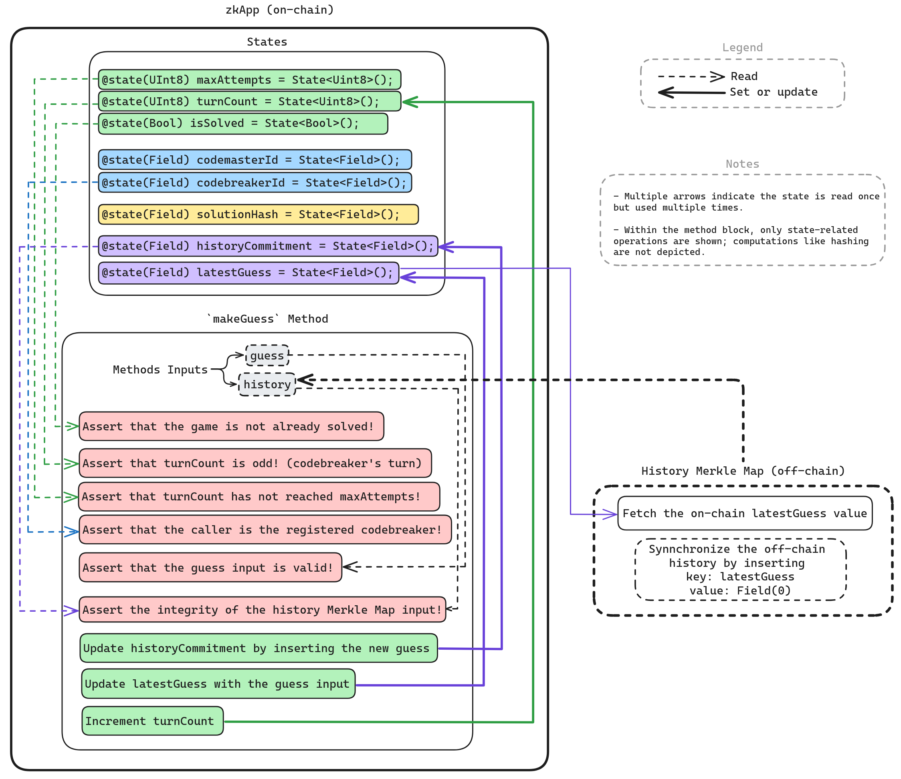
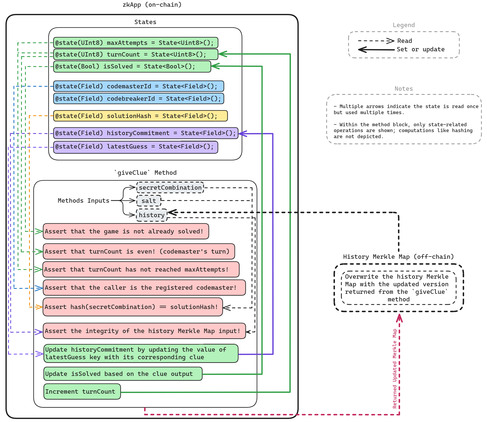
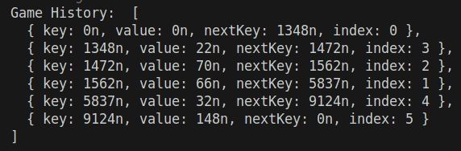

# Mina zkApp: Mina Mastermind Level 3


# Table of Contents

## Mastermind Game Documentation

- [Understanding the Mastermind Game](#understanding-the-mastermind-game)

  - [Overview](#overview)
  - [Game Rules](#game-rules)

- [Introduction](#introduction)
- [Motivation](#motivation)

- [Mastermind zkApp Structure](#mastermind-zkapp-structure)

  - [Mastermind States](#mastermind-states)
    - [maxAttempts](#maxattempts)
    - [turnCount](#turncount)
    - [isSolved](#issolved)
    - [codemasterId & codebreakerId](#codemasterid--codebreakerid)
    - [solutionHash](#solutionhash)
    - [historyCommitment](#historycommitment)
    - [latestGuess](#latestguess-refine-last-guess---key-read)
  - [Mastermind Methods](#mastermind-methods)
    - [initGame](#initgame)
    - [createGame](#creategame)
    - [makeGuess](#makeguess)
    - [giveClue](#giveclue)
  - [Merkle Map Display](#merkle-map-display)

- [How to Build & Test](#how-to-build--test)
  - [How to build](#how-to-build)
  - [How to run tests](#how-to-run-tests)
  - [How to run coverage](#how-to-run-coverage)
- [License](#license)

# Understanding the Mastermind Game

## Overview

- The game involves two players: a `Code Master` and a `Code Breaker`.
- Inspired by [mastermind-noir](https://github.com/vezenovm/mastermind-noir), this version replaces colored pegs with a combination of 4 unique, non-zero digits.

## Game Rules

- The Code Master hosts a game and sets a secret combination for the Code Breaker to guess.

- The Code Breaker makes a guess and waits for the Code Master to provide a clue.

- The clue indicates the following:

  - **Hits**: Digits that are correctly guessed and in the correct position.
  - **Blows**: Digits that are correct but in the wrong position.

  Example:

  |        | P1  | P2  | P3  | P4  |
  | ------ | --- | --- | --- | --- |
  | Secret | 5   | 9   | 3   | 4   |
  | Guess  | 5   | 7   | 8   | 9   |
  | Clue   | 2   | 0   | 0   | 1   |

  - Code Master's secret combination: **5 9 3 4**
  - Code Breaker's guess: **5 7 8 9**
  - Clue: **2 0 0 1**
    - Result: `1` hit and `1` blow.
      - The hit is `5` in the first position.
      - The blow is `9` in the fourth position.
      -

- The game continues with alternating guesses and clues until the Code Breaker achieves 4 hits and uncovers the secret combination or fails to do so within the **maximum allowed attempts**.

# Introduction

This implementation is part of the multi-level series of the Mastermind zkApp game, representing **Level 3**, which introduces the use of the `Indexed Merkle Map` API to store the game history (guesses and clues) off-chain.

Building upon the enhancements introduced in [Level 2](https://github.com/o1-labs-XT/mastermind-zkApp/tree/level2), Level 3 offers an upgrade over Level 1 by storing the entire game history off-chain.

Unlike [Level 2](https://github.com/o1-labs-XT/mastermind-zkApp/tree/level2), where the game history is packed and stored directly on-chain, **Level 3** employs an off-chain storage model. The game history is stored off-chain and verified on-chain using cryptographic commitments (Merkle root). This approach significantly enhances scalability by reducing on-chain storage requirements, as only the Merkle Root (commitment) is stored on-chain, while still ensuring the integrity of the off-chain game history through on-chain verification.

This off-chain model offers an optimal balance between privacy, scalability, and verifiable integrity, even though privacy is not the central focus of this particular implementation.

---

For a foundational understanding of the game mechanics and the enhancements introduced in Level 3, please refer to the [Mastermind Level 1 branch](https://github.com/o1-labs-XT/mastermind-zkApp/tree/level1?tab=readme-).

# Motivation

In the Level 1 implementation, both the [`unseparatedGuess` and `serializedClue` states](https://github.com/o1-labs-XT/mastermind-zkApp/blob/level1/src/Mastermind.ts#L27-L28) represent only a single guess and clue at any given time.

- While this approach works, it introduces potential challenges as it requires both players to manually track the history of the game.

  - Any mistake or oversight, particularly by the Code Breaker, could compromise their strategy, as they must rely on memory of prior clues to make informed guesses in subsequent turns.

  - Typically, the application frontend (not part of this project) would display the game’s history and progress to both players. However, since no live record is stored on-chain, this setup depends on trust that the frontend will accurately represent the game state without tampering.

  - Although players may notice inconsistencies based on their memory of previous moves, depending on frontend integrity undermines the trustless nature of a blockchain-based game.

The Level 3 implementation addresses these limitations by overcoming the zkApp’s 8-state storage constraint, utilizing the `Indexed Merkle Map` API to store the history of guesses and clues off-chain.

This approach introduces a **verifiable off-chain storage architecture**, eliminating the need for manual tracking and reducing the risk of player errors, ensuring a more reliable and trustless gameplay experience.

- Level 2 showcased packing the game history directly on-chain, leveraging the fact that the Mastermind game involves a limited number of small fields that can fit within the zkApp’s on-chain state.

- However, some applications may require storing larger volumes of data that cannot be efficiently packed into on-chain states. In such cases, Merkle tree data structures provide a scalable solution for off-chain storage, enabling the handling of larger datasets while ensuring data integrity through on-chain verification.

## Notes

- Managing the Merkle Tree off-chain, whether in a server or database, is the developer’s responsibility. While this implementation shows how to synchronize off-chain storage with on-chain updates, the full setup of server-side or database management is **not** demonstrated in this example.
- Off-chain data storage also offers improved privacy compared to on-chain storage. Although this particular implementation does not focus on privacy, it highlights how sensitive information can be kept off-chain, with only cryptographic commitments (such as the Merkle root) stored on-chain.

- **Warning**: This implementation does not address **concurrency** issues since the game is interactive and sequential by design. However, developers should consider concurrency when implementing off-chain storage solutions in applications where multiple updates may occur simultaneously.

# Mastermind zkApp Structure

Following the game rules, the [MastermindZkApp](./src/Mastermind.ts) should be deployed:

- The zkApp is initialized by calling the `initGame` method, with `maxAttempts` as the method parameter to set an upper limit.

- After initialization, the Code Master calls the `createGame` method to start the game and set a secret combination for the Code Breaker to solve.

- The Code Breaker then makes a guess by calling the `makeGuess` method with a valid combination as an argument.

- The Code Master submits the solution again to be checked against the previous guess and provides a clue.

- The Code Breaker should analyze the given clue and make another meaningful guess.

- The game continues by alternating between `makeGuess` and `giveClue` methods until the Code Breaker either uncovers the secret combination or fails by exceeding the allowed `maxAttempts`, concluding the game.

Now, let's explore the states and methods of our Mastermind zkApp.

## Mastermind States

The Mastermind zkApp utilizes 7 states, staying within the maximum storage capacity to ensure smooth functionality.

Let’s examine each state’s purpose and the smart workarounds used to optimize on-chain storage and reduce state usage.

### maxAttempts

- This state is set during game initialization and and ensures the number of attempts is limited between `5` and `15`.

- Without this state, the game would be biased in favor of the Code Breaker, allowing the game to continue indefinitely until the secret combination is solved.

### turnCount

- This state is essential for tracking game progress. It helps determine when the maximum number of attempts has been reached and also identifies whose turn it is to make a move. If the `turnCount` is even, it's the Code Master's turn to give a clue; if it's odd, it's the Code Breaker's turn to make a guess.

### codemasterId & codebreakerId

- These states represent the unique identifiers of the players, which are stored as the **hash** of their `PublicKey`.

- We avoid storing the `PublicKey` directly because it occupies two fields. By hashing the `PublicKey`, we save two storage states, reducing the total required states from four to two.

- Player identifiers are crucial for correctly associating each method call with the appropriate player, such as linking `makeGuess` to the Code Breaker and `giveClue` to the Code Master.

- Restricting access to methods ensures that only the intended players can interact with the zkApp, preventing intruders from disrupting the 1 vs 1 interactive game.

### solutionHash

- The solution must remain private; otherwise, the game loses its purpose. Therefore, whenever the Code Master provides a clue, they should enter the `secretCombination` as a method parameter.

- To maintain the integrity of the solution, it's hashed and stored on-chain when the game is first created.

- Each time the Code Master calls the `giveClue` method, the entered private secret combination is salted, hashed, and compared against the `solutionHash` stored on-chain. This process ensures the integrity of the combination and helps prevent side-channel attacks.

- **Note:** Unlike player IDs, where hashing is used for data compression, here it is used to preserve the privacy of the on-chain state and to ensure the integrity of the values entered privately with each method call.

### historyCommitment

- This state represents the Merkle root (commitment) of the Merkle Map, where the guess is stored as the key and the corresponding clue is serialized (or packed) when stored as the value.

- It is used to verify the integrity of the game history stored off-chain and to synchronize changes made during on-chain updates in the zkApp.

- Note that the guess (key) is initially inserted with an empty value (`Field(0)`), and then updated with the corresponding clue when the [giveClue](#giveclue) method is called.

  - This process relies on the [latestGuess](#latestguess) state to reference the last guess, as it is not possible to directly track the last inserted key in the Merkle Map.

- For more details, refer to the [makeGuess](#makeguess) and [giveClue](#giveclue) methods to understand how this commitment is used to verify the integrity of off-chain data and undergo updates after successful execution.

### latestGuess

- The `latestGuess` state holds the most recent guess submitted by the Code Breaker and is essential for updating that guess with the corresponding clue from the Code Master.

- This state ensures a sequential response to the last guess, as the Merkle Map does not inherently track the order of inserted keys (guesses).

- It also plays a crucial role in synchronizing the off-chain history Merkle Map after the execution of the [`makeGuess`](#makeguess) method.

- **Note:** A guess is represented as a single `Field` value encoded in decimal format. For example:

  - If the guess is `4 5 2 3`, it is encoded as the `Field` value `4523`.
  - The Code Master will later parse this value into individual digits to compare against the secret solution.

### isSolved

- This state is a `Bool` that indicates whether the Code Breaker has successfully uncovered the solution.

- It is crucial for determining the end of the game, signaling completion once the Code Breaker achieves `4` hits within the allowed `maxAttempts`.

## Mastermind Methods

### initGame

- Upon deployment, the Mastermind zkApp flexibly uses the `maxAttempts` argument to set the number of rounds between `5` and `15`, instead of relying on a hardcoded value.

- The steps to initialize a zkApp with arguments are as follows:

  - Create a separate zkApp method with an appropriate name.
  - Inside this method, call `super.init()` to initialize all state variables to `0`.
  - Use the method’s parameters to set specific state variables based on the caller’s input.

  Example:

  ```ts
  class HelloWorld extends SmartContract {
    @state(Field) x = State<Field>();

    @method async initWorld(myValue: Field) {
      super.init();
      this.x.set(myValue); // Set initial state based on caller's input
    }
  }
  ```

**Notes:**

- The `init()` method is predefined in the base `SmartContract` class, similar to a constructor.

  - It is automatically called when you deploy your zkApp with the zkApp CLI for the first time.
  - It is not called during contract upgrades or subsequent deployments.
  - The base `init()` method initializes provable types like `Field`, `UInt8` to `0`, and the `Bool` type to `Bool(false)`, as it's a wrapper around a field with a value of `0`.
  - Note that you cannot pass arguments to the `init` method of a `SmartContract`.

- Since the custom initialization method can be called by anyone at any time, refer to the [Security Considerations](https://github.com/o1-labs-XT/mastermind-zkApp?tab=readme-ov-file#initialize-must-be-called-first-and-only-once) in Level 1 to ensure it is implemented securely.

- For a more detailed explanation on initializing zkApps, please refer to the [comprehensive documentation](https://github.com/o1-labs-XT/mastermind-zkApp?tab=readme-ov-file#initgame) in Level 1.

---

### createGame

- This method should be called **after** initializing the game and **only once**.
- The method executes successfully when the following conditions are met:

  - The code master provides two arguments: `unseparatedSecretCombination` and a `salt`.

  - The `unseparatedSecretCombination` is split into an array of fields representing the four digits. An error is thrown if the number is not in the range of `1000` to `9999`.

  - The separated digits are validated to ensure they are unique and non-zero, with errors thrown if they do not meet these criteria.

  - The secret combination is then hashed with the salt and stored on-chain as `solutionHash`.

  - The caller's `PublicKey` is hashed and stored on-chain as `codemasterId` once the combination is validated.

  - Finally, the `turnCount` is incremented, signaling that the game is ready for the code breaker to `makeGuess`.
  - The first user to call this method with valid inputs will be designated as the code master.

- **Note:** For simplicity, security checks in this method have been abstracted. For more details, please refer to the [Security Considerations](#safeguarding-private-inputs-in-zk-snark-circuits).

---

### makeGuess

- This method should be called directly **after** a game is created or when a clue has been given for the previous guess.

- To maintain the progression of the game, there are several conditions that restrict when this method can be called:

  - If the game `isSolved`, this method can be called, but it will throw an error.

  - If the Code Breaker exceeds the `maxAttempts`, this method can be called, but it will throw an error.

  - The method enforces correct turn-taking by allowing the Code Breaker to make a guess only when the `turnCount` state is **odd**. If any of these conditions are not met, the method will still throw an error.

- Special handling is required when the method is called for the first time:

  - The first player to call `makeGuess` is registered as the Code Breaker for the rest of the game.
  - Once a Code Breaker is registered, only that player can continue to make guesses.

- After all the preceding checks pass, the Code Breaker's guess is validated, and several key operations take place before any state updates:

  - The on-chain [historyCommitment](#historycommitment) is fetched and asserted to match the root from the `history` input of this method. This ensures that the off-chain Merkle Map submitted by the Code Breaker is in sync with the commitment stored on-chain.
  - **Note:** It's crucial to initialize the [historyCommitment](#historycommitment) with the empty root of the Merkle Tree (height dependent). This initialization allows the first guess to be submitted by validating the empty Merkle Tree.
  - Once the Merkle Map's integrity is verified, the guess is inserted as a new key in the history Merkle Map, and the new root is set as the updated [historyCommitment](#historycommitment).
    - This step ensures that the history Merkle Map is only updated within the zkApp, enforcing synchronization between off-chain data and on-chain verification.
    - **Note:** `history = history.clone()` is used [here](./src/Mastermind.ts#L164) to avoid errors when modifying the input Merkle Map directly. Modifying inputs within circuits can cause errors, and cloning the history prevents this issue.

- The Merkle Map inherently disallows duplicate keys, thus preventing the Code Breaker from making a wrong move by entering the same guess.

  - This advantage of using the Merkle Map API simplifies the prevention of duplicate guesses. In Level 2, nullifying a repeated guess would be more complicated, as it would require scanning the entire history of guesses to check for duplicates.

- Finally, the submitted guess is stored on-chain, with the [latestGuess](#latestguess) state being updated to the current guess.
- The `turnCount` is then incremented, signaling the Code Master to read the guess and provide a clue.



- **Notes:**

  - To synchronize the off-chain history Merkle Map, the `latestGuess` state should be fetched after the successful execution of this method and inserted into the local Merkle Map to keep the history in sync.

    - This underscores the importance of `latestGuess`, as it plays a crucial role in synchronizing off-chain storage. Since the guess is a private method input, `latestGuess` is used to update the off-chain storage in this context.

  - Before submitting the next guess, the Code Breaker should:

    - Read the `latestGuess` state off-chain.
    - Retrieve the corresponding serialized clue from the Merkle Map using the `latestGuess` as the key.
    - Deserialize the clue to interpret the feedback.
    - Adjust their strategy based on the clue received.

    This process helps the Code Breaker understand the outcome of their previous guess and make informed decisions for subsequent moves.

### giveClue

- Similar to the `makeGuess` method, there are several conditions that restrict when this method can be called to maintain a consistent progression of the game:

  - Only the registered Code Master can call this method.
  - The method enforces the correct sequence by ensuring that the `turnCount` is **non-zero** (to avoid collision with the `createGame` call) and **even**.
  - If the game `isSolved`, this method is blocked.
  - If the Code Breaker exceeds the `maxAttempts`, this method cannot be executed.

- After the initial checks pass, the plain `unseparatedSecretCombination` input is separated into 4 digits, hashed with the salt, and asserted against the `solutionHash` state to verify the integrity of the secret combination.

- The [latestGuess](#latestguess) from the previous turn is fetched, split into individual digits, and compared against the secret combination. Based on this comparison, a clue is generated.

  - Each clue consists of four digits, where each digit can be `0`, `1`, or `2`, representing feedback from the Code Master:

    - `0`: No match.
    - `1`: Correct digit but wrong position.
    - `2`: Correct digit and correct position.

  - These digits are combined and stored as an 8-bit `Field` value in decimal format. For example:

  - If the clue digits are `1 1 1 1`, they are combined to form the number `1111`, which is stored as a `Field` value of `15` in decimal.

- The on-chain [historyCommitment](#historycommitment) is fetched and validated to match the root provided in the `history` input of this method.
- The value of the key corresponding to the `latestGuess` in the Merkle Tree is then updated with the serialized clue, and the new root is set as the updated [historyCommitment](#historycommitment).

- If the clue results in 4 hits (e.g., `2 2 2 2`), the game is marked as **solved**, and the `isSolved` state is updated to `Bool(true)`.

- Finally, the `turnCount` is incremented, making it odd and signaling the Code Breaker's turn to read the clue, interpret it, and make a meaningful guess—unless the game is already solved or the maximum number of attempts has been reached.



- **Note:** Unlike in the `makeGuess` method, the off-chain history Merkle Map is overwritten rather than synchronized.

  - The history Merkle Map is provided as an input and returned as a method output after updating it with the latest guess and corresponding clue.

  - Upon successful execution of this method, the off-chain history is replaced with the updated Merkle Map, effectively overwriting it.

  - **Efficiency Consideration:** Overwriting the Merkle Map off-chain after each successful on-chain transaction may be inefficient, especially for large datasets.

  - **Technical Insight:** This solution is feasible because the Merkle Map API can be utilized within provable methods. If we were to synchronize the off-chain history using traditional methods, we would need to add a new state variable for the clue to maintain synchronization. This is because the only public update is the history root, which doesn't reveal any information about the clue since the `secretCombination` remains private.

---

## Merkle Map Display

While the Merkle Map stores key/value pairs of guesses and corresponding clues, it's important to display the order of these entries to gain insight into the game's progress.

Fortunately, the `Indexed` Merkle Map API allows us to display this order along with all keys and values by accessing the indexes. This can be done as shown below:

```ts
console.log('Game History: ', history.data.get().sortedLeaves);
```



# How to Build & Test

## How to build

```sh
npm run build
```

## How to run tests

```sh
npm run test
npm run testw # watch mode
```

## How to run coverage

```sh
npm run coverage
```

# License

[Apache-2.0](LICENSE)
