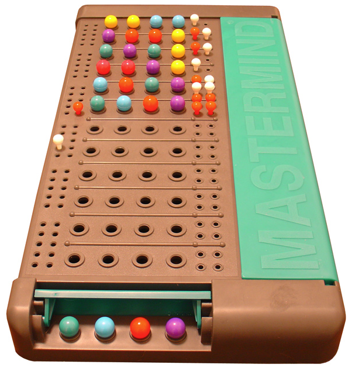
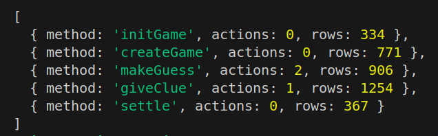
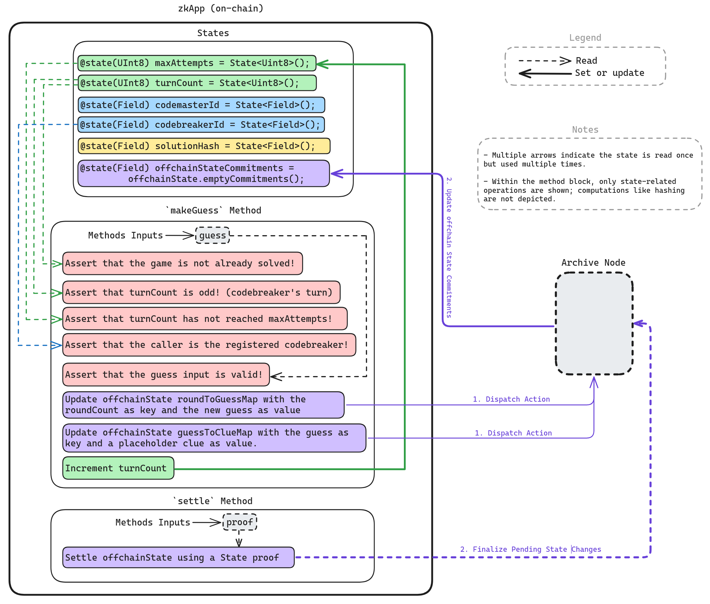
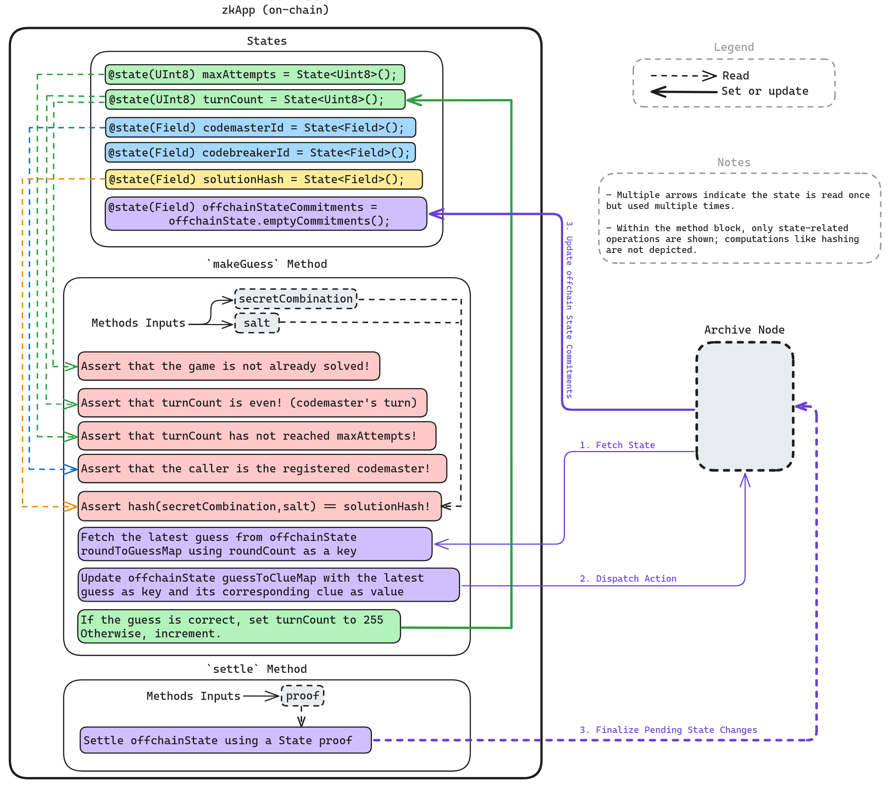
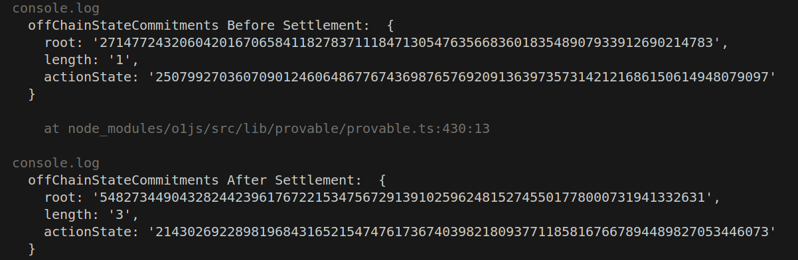

# Mina zkApp: Mina Mastermind Level 4



# Table of Contents

## Mastermind Game Documentation

- [Understanding the Mastermind Game](#understanding-the-mastermind-game)

  - [Overview](#overview)
  - [Game Rules](#game-rules)

- [Introduction](#introduction)
- [Motivation](#motivation)

- [OffChainState](#offchain-state)

  - [How to Use Offchain Storage](#how-to-use-offchain-storage)
  - [Features](#features)
  - [Limitations](#limitations)
  - [Resources](#resources)

- [Mastermind zkApp Structure](#mastermind-zkapp-structure)

  - [Mastermind States](#mastermind-states)
    - [maxAttempts](#maxattempts)
    - [turnCount](#turncount)
    - [codemasterId & codebreakerId](#codemasterid--codebreakerid)
    - [solutionHash](#solutionhash)
    - [offchainStateCommitments](#offchainstatecommitments)
  - [Mastermind Methods](#mastermind-methods)
    - [initGame](#initgame)
    - [createGame](#creategame)
    - [makeGuess](#makeguess)
    - [giveClue](#giveclue)
    - [settle](#settle)

- [How to Build & Test](#how-to-build--test)
  - [How to build](#how-to-build)
  - [How to run tests](#how-to-run-tests)
  - [How to run coverage](#how-to-run-coverage)
- [License](#license)

# Understanding the Mastermind Game

## Overview

- The game involves two players: a `Code Master` and a `Code Breaker`.
- Inspired by [mastermind-noir](https://github.com/vezenovm/mastermind-noir), this version replaces colored pegs with a combination of 4 **unique**, **non-zero** digits.

## Game Rules

- The Code Master hosts a game and sets a secret combination for the Code Breaker to guess.

- The Code Breaker makes a guess and waits for the Code Master to provide a clue.

- The clue indicates the following:

  - **Hits**: Digits that are correctly guessed and in the correct position.
  - **Blows**: Digits that are correct but in the wrong position.

  Example:

  |        | P1  | P2  | P3  | P4  |
  | ------ | --- | --- | --- | --- |
  | Secret | 5   | 9   | 3   | 4   |
  | Guess  | 5   | 7   | 8   | 9   |
  | Clue   | 2   | 0   | 0   | 1   |

  - Code Master's secret combination: **5 9 3 4**
  - Code Breaker's guess: **5 7 8 9**
  - Clue: **2 0 0 1**
    - Result: `1` hit and `1` blow.
      - The hit is `5` in the first position.
      - The blow is `9` in the fourth position.

- The game continues with alternating guesses and clues until the Code Breaker achieves **4 hits** and uncovers the secret combination or _fails_ to do so within the **maximum allowed attempts**.

# Introduction

This implementation is part of the multi-level series of the Mastermind zkApp game, representing **Level 4**, which introduces the use of the [OffchainState API](https://docs.minaprotocol.com/zkapps/writing-a-zkapp/feature-overview/offchain-storage) to store the game history (guesses and clues) off-chain.

Similar to [Level 3](https://github.com/o1-labs-XT/mastermind-zkApp/tree/level3), Level 4 offers an upgrade over Levels [1](https://github.com/o1-labs-XT/mastermind-zkApp/tree/level1) and [2](https://github.com/o1-labs-XT/mastermind-zkApp/tree/level2) by introducing enhanced scalability through off-chain storage for the entire game history.

Building upon [Level 3](https://github.com/o1-labs-XT/mastermind-zkApp/tree/level3) and addressing its limitations, this implementation aims to showcase a scalable off-chain storage solution that resolves concurrency issues and simplifies storage management, eliminating the need for developers to maintain dedicated servers or databases.

---

For a foundational understanding of the game mechanics and the enhancements introduced in Level 4, please refer to the [Mastermind Level 1 branch](https://github.com/o1-labs-XT/mastermind-zkApp/tree/level1?tab=readme-).

# Motivation

- Storing the game history off-chain addresses two key challenges: the need to manually track game history and the limitations imposed by on-chain state size. By leveraging the `OffChainState` API, guesses and clues are stored off-chain, reducing player errors and enabling a trustless gameplay experience.

- For a more detailed explanation of the motivation behind storing the game history off-chain, refer to the [motivation section](https://github.com/o1-labs-XT/mastermind-zkApp/tree/level3?tab=readme-ov-file#motivation) in the Level 3 documentation.

---

- While the `Indexed Merkle Tree` used in [Level 3](https://github.com/o1-labs-XT/mastermind-zkApp/tree/level3) provided a scalable storage solution, it introduced several challenges:

  - **Concurrency Issues:** Each state update requires updating the Merkle root on-chain, which can lead to conflicts or failed transactions when multiple updates occur simultaneously. This can lead to race conditions and degrade the user experience.

  - **Off-Chain Management Overhead:** The need to manage the Merkle Tree off-chain, whether on a server or in a database, adds complexity for developers. This requires setting up, maintaining, and integrating an external storage solution, which can be time-consuming and error-prone.

  - **State Liveness Concerns:** Merkle Trees ensure data integrity through cryptographic commitments but do not guarantee data availability (liveness). For example, a database administrator could delete the database, effectively deadlocking the zkApp. This reliance on off-chain infrastructure introduces a trust assumption regarding the availability of stored data, which undermines the fully trustless nature of the system.

- The `OffChainState` API is a higher-level abstraction built on top of the `IndexedMerkleMap` and [Actions & Reducer](https://docs.minaprotocol.com/zkapps/writing-a-zkapp/feature-overview/actions-and-reducer). It addresses the following limitations:

  - **Concurrency Resolution:** The `OffChainState` API uses the `Actions & Reducer` pattern to manage concurrent updates effectively. State updates are dispatched as actions and later reconciled during a settlement phase by submitting a `Settlement` proof. This design resolves concurrency issues by processing pending actions in a sequenced manner.

    - **Note:** While this implementation does not address concurrency issues, since the game is inherently interactive and sequential, it serves as an example of how such issues can be addressed in applications where concurrency is a factor.

  - **State liveness and management:** Off-chain states are stored directly in Mina's archive nodes, ensuring consistent data availability without requiring developers to manage external storage solutions. This approach eliminates concerns about liveness and reduces reliance on centralized infrastructure.

    - **Note:** Since data resides in the archive nodes, it is publicly accessible and no longer private. This must be considered when designing applications that involve sensitive data.

# OffChain State

The Offchain State API provides a secure and provable connection between on-chain smart contracts and off-chain data. It structures dispatched actions into a Merkle Tree, ensuring provable commitments with the Merkle root stored on-chain for verification.

Using **Actions and Reducer**, the API manages state changes efficiently: actions dispatch updates, and the reducer finalizes them during settlement. Once settled, all state is fully recoverable directly from actions, eliminating the need for extra events or external data storage. This design enables scalable and trustless state management for zkApps.

## How to Use Offchain Storage

The setup for Offchain State involves two main components:

### 1. Declaring the Offchain State

The Offchain State is declared using an object that defines the state type, supporting **key-value maps** and **single-field storage**.

In this implementation, we define two mappings as follows:

```ts
{
  roundToGuessMap: OffchainState.Map(UInt8, Field),
  guessToClueMap: OffchainState.Map(Field, Field),
}
```

- `roundToGuessMap`: Maps a round (`UInt8`) to a guess (`Field`).
- `guessToClueMap`: Maps a guess (`Field`) to a serialized clue (`Field`).

**Note**: Instead of separating mappings, we could map `roundCount` directly to a composite type (e.g., a struct containing both the guess and the serialized clue). However, this implementation chooses to use two linked mappings for clarity and flexibility.

Single-field storage is also supported. For instance, you could add:

```ts
roundCount: OffchainState.Field(UInt8);
```

### 2. Configuring Offchain Storage

The configuration for Offchain Storage is defined with an object that includes **optional** parameters:

- `logTotalCapacity`:

  - Specifies the base-2 logarithm of the total capacity for offchain state.
  - Example: For 1 million entries, set `logTotalCapacity` to 20 (`2^20 = ~1M`).
  - **Default**: `30` (~1 billion entries).

- `maxActionsPerUpdate`:

  - Sets the maximum number of actions (e.g., `.update()` or `.overwrite()`) that can be performed in a single smart contract method.
  - **Default**: `4`.

- `maxActionsPerProof`:
  - Defines the number of actions included in a proof.
  - **Default**: `22`.

**Note:** You can display the `actions` for each method by using `await zkapp.analyzeMethods()`. This provides insights into the `maxActionsPerUpdate` required for each method.

- **Example:** Displaying filtered logs showing only the method name, actions, and rows can be achieved with the following command:

  ```ts
  console.log(
    Object.entries(await MastermindZkApp.analyzeMethods()).map(
      ([method, { actions, rows }]) => ({ method, actions, rows })
    )
  );
  ```

- The output will look like this:

  

### Creating a StateProof

The `StateProof` type is used to finalize state changes via a [recursive reducer](https://medium.com/zknoid/mina-action-reducers-guide-writing-our-own-reducers-81802287776f):

```ts
class StateProof extends offchainState.Proof {}
```

### Declaring Offchain State Commitments and Initializing Offchain State

Declare the [offchainStateCommitments](#offchainstatecommitments) and initialize an offchain state instance for your contract.
This returns a memoized instance if one already exists for the contract.

Example:

```ts
const offchainStateInstance = offchainState.init();

class MyContract extends SmartContract {
  @state(OffchainStateCommitments) offchainStateCommitments = State(
    OffchainStateCommitments.empty()
  );

  offchainState = offchainStateInstance;

  @method async settle(proof: StateProof) {
    await this.offchainState.settle(proof);
  }
}
```

### Assigning the Contract Instance to Offchain Storage

To interact with your zkApp using Offchain Storage, assign the smart contract instance to the offchain storage. This also compiles the recursive Offchain zkProgram in the background.

Example:

```ts
const zkapp = new MyContract(contractAddress);
zkapp.offchainState.setContractInstance(zkapp);

// Compile Offchain state program
await offchainState.compile();

// Compile smart contract
await MyContract.compile();
```

### Calling the Settle Method

For details on calling the settle method, refer to the [settle method documentation](#settle).

## Features

- All information required to use offchain state is derived directly from actions, eliminating the need for extra events or external data storage.
- No practical limits exist on the number of state fields and maps that can be used.
- Field and map values support provable types of up to ~100 field elements (approximately the size of an action). Map keys are not size-limited since they do not need to be part of the action.

## Limitations

- **Lagging State:** State is only available for retrieval (`.get()`) after it has been settled.
- **Scalability Issues:** The Offchain State API has limited scalability due to high latency. Currently, the Merkle tree is reconstructed on the fly by each user from fetched actions, which is inefficient for large-scale applications.
- **Archive Node Bottleneck:** The slowness of the archive node is a significant bottleneck, impacting the ability to settle and access state efficiently.

**Note:** For more details on the limitations of the Offchain State API, refer to the [Offchain State Showcase RFC](https://github.com/o1-labs/rfcs/blob/76045f062f87c4ab98c95ad7bed3bddb0cd565ed/00xx-offchain-state-showcase.md#drawbacks).

## Resources

- [Mina Docs: Offchain Storage Documentation](https://docs.minaprotocol.com/zkapps/writing-a-zkapp/feature-overview/offchain-storage)

- [XT Name Service Example](https://github.com/o1-labs-XT/name-service-example/tree/main)

- [Offchain State Showcase RFC](https://github.com/o1-labs/rfcs/blob/76045f062f87c4ab98c95ad7bed3bddb0cd565ed/00xx-offchain-state-showcase.md#drawbacks)

- [ZkNoid Blog: Mina Action & Reducers Guide: Writing our own reducers](https://medium.com/zknoid/mina-action-reducers-guide-writing-our-own-reducers-81802287776f)

- [o1js ExampleContract](https://github.com/o1-labs/o1js/blob/main/src/lib/mina/actions/offchain-contract-tests/ExampleContract.ts)

- [Offchain State Instance PR](https://github.com/o1-labs/o1js/pull/1834):
  Introduced updates to the Offchain State API initialization process, released in `o1js` version `1.9.1`.

# Mastermind zkApp Structure

Following the game rules, the [MastermindZkApp](./src/Mastermind.ts) should be deployed as follows:

- The zkApp is initialized by calling the `initGame` method, with `maxAttempts` as the method parameter to set an upper limit.

- After initialization, the Code Master calls the `createGame` method to start the game and set a secret combination for the Code Breaker to solve.

- The Code Breaker then makes a guess by calling the `makeGuess` method with a valid combination as an argument.

- The offchain state needs to be settled by calling the `settle` method. This ensures the guess is accessible to the `giveClue` method, where it can be mapped to the corresponding clue.

- The Code Master calls the `giveClue` method to provide a clue for the latest guess by submitting their secret combination and a salt value. This method ensures the integrity of the secret combination and updates the offchain state with a clue corresponding to the most recent guess.

- The offchain state must again be settled to allow the Code Breaker to access the provided clue before submitting another guess.

- The Code Breaker analyzes the clue and makes another meaningful guess.

- The game alternates between `makeGuess` and `giveClue` methods until the Code Breaker either discovers the secret combination or exhausts the allowed `maxAttempts`, concluding the game.

Now, let's explore the states and methods of the Mastermind zkApp.

## Mastermind States

The Mastermind zkApp utilizes 8 states, staying within the maximum storage capacity.

### maxAttempts

- This state is set during game initialization and and ensures the number of attempts is limited between `5` and `15`.

- Without this state, the game would be biased in favor of the Code Breaker, allowing the game to continue indefinitely until the secret combination is solved.

### turnCount

- The `turnCount` state is crucial for tracking the progress of the game. It determines when the maximum number of attempts has been reached and identifies whose turn it is to make a move. An _even_ `turnCount` indicates it is the Code Master's turn to provide a clue, while an _odd_ `turnCount` indicates it is the Code Breaker's turn to make a guess.

- In previous levels, a `Bool` state called `isSolved` was used to indicate whether the Code Breaker had successfully uncovered the solution, marking the end of the game. This state signaled completion once the Code Breaker achieved `4` hits within the allowed `maxAttempts`.

- The `isSolved` state, which could either be `True` or `False`, is replaced in this implementation with a numeric state by assigning a distinctive value when the game is solved:
  - Here, the value `255` is used to indicate the game's conclusion. This is a unique value for `turnCount`, as it remains well above the maximum possible `turnCount` for the allowed `maxAttempts` (e.g., `15` attempts in this implementation).
  - When `turnCount` equals `255`, it signifies that the Code Breaker has successfully uncovered the secret combination, concluding the game.
- This technique simplifies the design by removing the need for a separate `isSolved` state, effectively saving on on-chain storage for the zkApp.

### codemasterId & codebreakerId

- These states represent the unique identifiers of the players, which are stored as the **hash** of their `PublicKey`.

- We avoid storing the `PublicKey` directly because it occupies two fields. By hashing the `PublicKey`, we save two storage states, reducing the total required states from four to two.

- Player identifiers are crucial for correctly associating each method call with the appropriate player, such as linking `makeGuess` to the Code Breaker and `giveClue` to the Code Master.

- Restricting access to methods ensures that only the intended players can interact with the zkApp, preventing intruders from disrupting the 1 vs 1 interactive game.

### solutionHash

- The solution must remain private; otherwise, the game loses its purpose. Therefore, whenever the Code Master provides a clue, they should enter the `secretCombination` as a method parameter.

- To maintain the integrity of the solution, it's hashed and stored on-chain when the game is first created.

- Each time the Code Master calls the `giveClue` method, the entered private secret combination is salted, hashed, and compared against the `solutionHash` stored on-chain. This process ensures the integrity of the combination and helps prevent side-channel attacks.

- **Note:** Unlike player IDs, where hashing is used for data compression, here it is used to preserve the privacy of the on-chain state and to ensure the integrity of the values entered privately with each method call.

### offchainStateCommitments

- The `offchainStateCommitments` state is a struct consisting of **three fields** that define commitments that track the current state of an offchain Merkle tree built from dispatched actions.

- The `offchainStateCommitments` fields include:
  - **root**: The root of the current Merkle tree.
  - **length**: The number of elements in the current Merkle tree.
  - **actionState**: A hash representing the sequence of actions applied to construct the current Merkle tree.

The `OffChainState` API is a high-level abstraction over an `IndexedMerkleMap`. In this context:

- The `root` and `length` components provide commitments to the structure of the Indexed Merkle Map.
- The `actionState` component serves as a commitment to the history of dispatched actions, as described in [Actions & Reducer](https://docs.minaprotocol.com/zkapps/writing-a-zkapp/feature-overview/actions-and-reducer).

**Note:** The offchain state commitments are updated only after the settlement process, as described in the [settle method](#settle).

## Mastermind Methods

### initGame

- Upon deployment, the Mastermind zkApp flexibly uses the `maxAttempts` argument to set the number of rounds between `5` and `15`, instead of relying on a hardcoded value.

- The steps to initialize a zkApp with arguments are as follows:

  - Create a separate zkApp method with an appropriate name.
  - Inside this method, call `super.init()` to initialize all state variables to `0`.
  - Use the method’s parameters to set specific state variables based on the caller’s input.

  Example:

  ```ts
  class HelloWorld extends SmartContract {
    @state(Field) x = State<Field>();

    @method async initWorld(myValue: Field) {
      super.init();
      this.x.set(myValue); // Set initial state based on caller's input
    }
  }
  ```

**Notes:**

- The `init()` method is predefined in the base `SmartContract` class, similar to a constructor.

  - It is automatically called when you deploy your zkApp with the zkApp CLI for the first time.
  - It is not called during contract upgrades or subsequent deployments.
  - The base `init()` method initializes provable types like `Field`, `UInt8` to `0`, and the `Bool` type to `Bool(false)`, as it's a wrapper around a field with a value of `0`.
  - Note that you cannot pass arguments to the `init` method of a `SmartContract`.

- Since the custom initialization method can be called by anyone at any time, refer to the [Security Considerations](https://github.com/o1-labs-XT/mastermind-zkApp?tab=readme-ov-file#initialize-must-be-called-first-and-only-once) in Level 1 to ensure it is implemented securely.

- For a more detailed explanation on initializing zkApps, please refer to the [comprehensive documentation](https://github.com/o1-labs-XT/mastermind-zkApp?tab=readme-ov-file#initgame) in Level 1.

---

### createGame

- This method should be called **after** initializing the game and **only once**.
- The method executes successfully when the following conditions are met:

  - The code master provides two arguments: `unseparatedSecretCombination` and a `salt`.

  - The `unseparatedSecretCombination` is split into an array of fields representing the four digits. An error is thrown if the number is not in the range of `1000` to `9999`.

  - The separated digits are validated to ensure they are unique and non-zero, with errors thrown if they do not meet these criteria.

  - The secret combination is then hashed with the salt and stored on-chain as `solutionHash`.

  - The caller's `PublicKey` is hashed and stored on-chain as `codemasterId` once the combination is validated.

  - Finally, the `turnCount` is incremented, signaling that the game is ready for the code breaker to make the **first** guess.
  - The first user to call this method with valid inputs will be designated as the code master.

- **Note:** For simplicity, security checks in this method have been abstracted. For more details, please refer to the [Security Considerations](#safeguarding-private-inputs-in-zk-snark-circuits).

---

### makeGuess

- This method should be called directly **after** a game is created or when a clue has been given for the previous guess.

- To maintain the progression of the game, there are several conditions that restrict when this method can be called:

  - If the game is already solved (indicated by `turnCount` being set to `255`), this method can be called, but it will throw an error.

  - If the Code Breaker exceeds the `maxAttempts`, this method can be called, but it will throw an error.

  - The method enforces correct turn-taking by allowing the Code Breaker to make a guess only when the `turnCount` state is **odd**. If any of these conditions are not met, the method will still throw an error.

- Special handling is required when the method is called for the first time:

  - The first player to call `makeGuess` is registered as the Code Breaker for the rest of the game.
  - Once a Code Breaker is registered, only that player can continue to make guesses.

- After all the preceding checks pass, the Code Breaker's guess is validated, and several key operations take place before any state updates:

  - The `roundCount` is calculated to track the game's progress, where each round consists of a guess and its corresponding clue. This value ensures that the mapping of guesses to rounds is sequential and reflects the game's progression.

  - The `roundToGuessMap` is then updated, assigning the `roundCount` as the key and the validated guess as the value. Since this is the first time this guess is being added for the current round, the `from` value is set to `undefined`, and the `to` value is the Code Breaker's validated guess. This mapping keeps a record of guesses in the order they are made.

  - Next, the `guessToClueMap` is updated with the validated guess as the key and a placeholder clue (set to the maximum field value) as the value. This prepares the mapping for the Code Master to later provide the actual clue corresponding to the guess.

  - **Notes:**

    - The mapping updates are dispatched as actions and remain pending. They can only be accessed, either on-chain or off-chain, after they are finalized by calling the [settle method](#settle).

    - The OffChainState model, leveraging the Indexed Merkle Map, prevents duplicate guesses by disallowing duplicate keys. This eliminates the need for complex logic, as would be required in Level 2, to scan and handle duplicate entries, ensuring a more efficient process.

- Finally, the `turnCount` is incremented, allowing the Code Master to read the guess and provide a clue.

- **Note:** The Code Breaker cannot dispatch multiple guesses, as the method call is restricted by the parity of the `turnCount`. While the design of the offchain state supports dispatching multiple actions and reducing them later, method access is intentionally limited to align with the game logic. It is the developer's responsibility to enforce such restrictions in similar scenarios.



Before submitting the next guess, the Code Breaker should follow these steps:

- Settle the state to access the outcome of their previous guess.
- Calculate the latest `roundCount` from the on-chain `turnCount`.
- Retrieve their most recent guess from the `roundToGuessMap`.
- Fetch the corresponding serialized clue from the zkApp's `OffChainState` `guessToClueMap` using the `latestGuess` as the key.
- Deserialize the clue to interpret the feedback.
- Adjust their strategy based on the clue received.

This process allows the Code Breaker to understand the outcome of their previous guess and make informed decisions for future moves.

### giveClue

- Similar to the `makeGuess` method, there are several conditions that restrict when this method can be called to maintain a consistent progression of the game:

  - Only the registered Code Master can call this method.
  - The method enforces the correct sequence by ensuring that the `turnCount` is **non-zero** (to avoid collision with the `createGame` call) and **even**.
  - If the game is already solved (indicated by `turnCount` being set to `255`), this method can be called, but it will throw an error.
  - If the Code Breaker exceeds the `maxAttempts`, this method can be called, but it will throw an error.

- After the initial checks pass, the `unseparatedSecretCombination` input is separated into 4 digits, hashed with the salt, and asserted against the `solutionHash` state to verify the integrity of the secret combination.

- The `roundCount` is calculated from `turnCount` and used as a key to fetch the most recent guess from the offchainState's `roundToGuessMap`.

- The latest guess is then split into individual digits and compared with the secret combination. Based on this comparison, a clue is generated.

  - Each clue consists of four digits, where each digit can be `0`, `1`, or `2`, representing feedback from the Code Master:

    - `0`: No match.
    - `1`: Correct digit but wrong position.
    - `2`: Correct digit and correct position.

  - These digits are combined and stored as an **8-bit** `Field` value in decimal format. For example:

    - If the clue digits are `1 1 1 1`, they are combined to form the number `1111`, which is stored as a `Field` derived from the bits `01 01 01 01`, equivalent to the decimal value `85`.

- The value of the key corresponding to the `latestGuess` in the `guessToClueMap` is then updated with the serialized clue

  - The `from` value is the initial placeholder clue set by the `makeGuess` method.
  - The `to` value is the serialized clue corresponding to the latest guess.

- If the clue results in 4 hits (e.g., `2 2 2 2`), the game is marked as **solved**, and the `turnCount` state is set to `255`.

- Else, the `turnCount` is incremented, making it odd and signaling the Code Breaker's turn to read the clue, interpret it, and make a meaningful guess; unless the game is already solved or the maximum number of attempts has been reached.



### settle

- There are no restrictions on who can call the `settle` method.

  - **Note:** This flexibility allows certain applications to incentivize users to settle the state as part of their functionality.

- The `settle` method ensures the offchain state is reconciled, making all published changes verifiable and accessible.

---

- The settlement process involves the following steps:

1. **Generate a State Proof**:  
   A `StateProof` is required to settle the offchain state. This proof updates the commitments to the offchain state, including the Merkle root and action state.

   It can be generated using the following code:

   ```ts
   const proof = await zkapp.offchainState.createSettlementProof();
   ```

2. **Invoke the settle Method**:

   Once the state proof is generated, it is passed to the `settle` method. Upon invocation, the method:

   - Automatically retrieves all pending actions (state changes).
   - Resolves these actions using a recursive reducer, updating the offchain commitments.

3. **Access Finalized State**:

   After the settlement process completes, the published state changes are finalized. These updates can then be accessed both on-chain through zkApp methods and off-chain.

4. **Example Settlement Process**:

   The entire settlement process can be implemented as follows:

   ```ts
   const stateProof = await zkapp.offchainState.createSettlementProof();

   await Mina.transaction(signerKey.toPublicKey(), () =>
     zkapp.settle(stateProof)
   )
     .sign([signerKey])
     .prove()
     .send();
   ```

The figure below illustrates an example of settlement after calling the [makeGuess](#makeGuess) method for the first time. It shows that the [offchainStateCommitments](#offchainstatecommitments) are only updated once the settlement process is completed:



---

# How to Build & Test

## How to build

```sh
npm run build
```

## How to run tests

```sh
npm run test
npm run testw # watch mode
```

## How to run coverage

```sh
npm run coverage
```

# License

[Apache-2.0](LICENSE)
