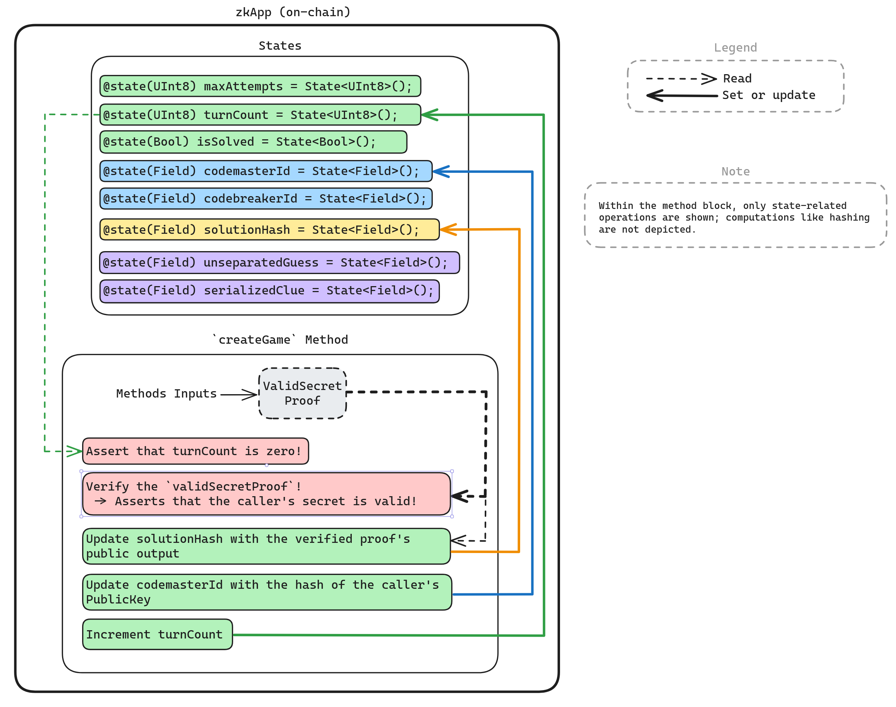

# Mina zkApp: Mina Mastermind Level 5


# Table of Contents

## Mastermind Game Documentation

- [Understanding the Mastermind Game](#understanding-the-mastermind-game)

  - [Overview](#overview)
  - [Game Rules](#game-rules)

- [Introduction](#introduction)
- [Motivation](#motivation)

- [Recursion](#recursion)

  - [Definition](#definition)
  - [Use Cases](#use-cases)

    - [Proof / Logic Compression](#proof--logic-compression)
    - [Parallelization / Work distribution](#parallelization--work-distribution)
    - [Proof Composability](#proof-composability)

  - [Resources and Examples](#resources-and-examples)

- [Mastermind zkApp Structure](#mastermind-zkapp-structure)

  - [Mastermind States](#mastermind-states)
    - [maxAttempts](#maxattempts)
    - [turnCount](#turncount)
    - [codemasterId & codebreakerId](#codemasterid--codebreakerid)
    - [solutionHash](#solutionhash)
    - [unseparatedGuess](#unseparatedguess)
    - [serializedClue](#serializedclue)
    - [isSolved](#issolved)
  - [Mastermind Methods](#mastermind-methods)
    - [initGame](#initgame)
    - [createGame](#creategame)
    - [makeGuess](#makeguess)
    - [giveClue](#giveclue)

- [How to Build & Test](#how-to-build--test)
  - [How to build](#how-to-build)
  - [How to run tests](#how-to-run-tests)
  - [How to run coverage](#how-to-run-coverage)
- [License](#license)

# Understanding the Mastermind Game

## Overview

- The game involves two players: a `Code Master` and a `Code Breaker`.
- Inspired by [mastermind-noir](https://github.com/vezenovm/mastermind-noir), this version replaces colored pegs with a combination of 4 **unique**, **non-zero** digits.

## Game Rules

- The Code Master hosts a game and sets a secret combination for the Code Breaker to guess.

- The Code Breaker makes a guess and waits for the Code Master to provide a clue.

- The clue indicates the following:

  - **Hits**: Digits that are correctly guessed and in the correct position.
  - **Blows**: Digits that are correct but in the wrong position.

  Example:

  |        | P1  | P2  | P3  | P4  |
  | ------ | --- | --- | --- | --- |
  | Secret | 5   | 9   | 3   | 4   |
  | Guess  | 5   | 7   | 8   | 9   |
  | Clue   | 2   | 0   | 0   | 1   |

  - Code Master's secret combination: **5 9 3 4**
  - Code Breaker's guess: **5 7 8 9**
  - Clue: **2 0 0 1**
    - Result: `1` hit and `1` blow.
      - The hit is `5` in the first position.
      - The blow is `9` in the fourth position.

- The game continues with alternating guesses and clues until the Code Breaker achieves **4 hits** and uncovers the secret combination or _fails_ to do so within the **maximum allowed attempts**.

# Introduction

This implementation is the last part of the multi-level series of the Mastermind zkApp game, representing **Level 5**.

Unlike the incremental enhancements made in previous levels, this final implementation does not introduce additional state storage optimizations. Instead, it returns to the simpler baseline established in [Level 1](https://github.com/o1-labs-XT/mastermind-zkApp/tree/level1?tab=readme-) and focuses on a new concept: **recursion**.

The key difference from Level 1 is that, rather than performing certain logic directly within zkApp methods, this approach delegates those computations to external **ZkProgram**s that generate proofs of the required statements. As a result, the zkApp methods need only verify these proofs, rather than carry out the computations themselves.

**Examples:**

- In the [createGame method](#creategame), a proof verifies that the Code Master submitted a valid secret solution, removing the need to run that logic within the zkApp method itself.

- In the [makeGuess method](#makeguess), a proof verifies that the Code Breaker submitted a valid guess.

- In the [giveClue method](#giveclue), a proof verifies that the Code Master produced a valid clue based on the secret solution and the latest guess.

---

For a foundational understanding of the game's mechanics and the security considerations, please refer to the [Mastermind Level 1 branch](https://github.com/o1-labs-XT/mastermind-zkApp/tree/level1?tab=readme-).

# Motivation

This level does not focus on optimization; instead, it uses the `ZkProgram` API to demonstrate how to integrate recursion into your zkApp.

As such, this implementation is primarily an educational example that serves as a role model for writing a `ZkProgram`, integrating its proofs into a zkApp, and thoroughly testing that integration.

Compared to Level 1, this implementation delegates certain statements previously handled within the zkApp to external ZkPrograms. This approach is considered recursion because the zkApp method, which already generates its own proof, now also verifies an externally generated proof. In other words, one proof validates another, capturing the essence of recursion.

Although the use case of recursion in this Mastermind implementation is trivial and primarily serves as an example, we will use this context to explore the concept of recursion more deeply, examining various applications and the benefits it can offer.

# Recursion

## Definition

In the context of ZKPs, recursion is the process where one proof verifies another. This can involve verifying a proof originating from the same circuit or a different one. As a result, a nested structure of verifications emerges, with each proof building upon and validating the previous one; hence the term **recursion**.

Now, let’s explore the practical use cases of recursion.

**Notes:**

- In o1js, `ZkProgram` is the general purpose API for creating zero knowledge proofs. A ZkProgram is similar to zkApp smart contracts but isn't tied to an on-chain account.

- You can use `ZkProgram` to define the steps of a recursive program and like `zkApp` methods, `ZkProgram` methods execute off-chain.

## Use Cases

### Proof / Logic Compression

**Linear recursion** is a technique that constructs a sequential chain of verifications for the same circuit.

By verifying a single recursive proof, you implicitly validate all the chained statements or updates that it represents.

Recursive proofs maintain a constant proof size of the base circuit, but in this context, **compression** refers to incorporating additional statements and updates without increasing the proof’s overall size. As a result, a proof can represent greater logical complexity while preserving its original size.

This capability underpins advanced scaling strategies such as [Scaling Throughput with zkRollups](https://docs.minaprotocol.com/zkapps/tutorials/recursion#scaling-throughput-with-zkrollups-and-app-chains) and [Scaling Proof Size](https://docs.minaprotocol.com/zkapps/tutorials/recursion#scaling-proof-size), among other applications.

**Notes:**

- The compression property of recursion can help overcome o1js circuit-size limits by dividing large circuits into smaller pieces and then recombining them recursively, keeping the overall proof as succinct as a single component.

- While this approach may be computationally intensive, techniques like [parallelization](#parallelization--work-distribution) can speed up the process.

**Examples:**

- **Succinct Blockchain:** Mina uses linear recursive proofs to compress an infinitely growing blockchain into a **constant-size** proof.

- **App-Specific Rollups:** An application like a recursive Mastermind game (not this specific implementation) can rely on linear recursive proofs to advance its state machine without continually syncing on-chain.
  - [Code Example](https://github.com/jackryanservia/mastermind/tree/main)
  - [Workshop Video](https://www.youtube.com/watch?v=HveLAT21t4M)
- **Additional Examples:** Explore Add, Rollup, and Voting ZkProgram [Code Examples](https://github.com/o1-labs/docs2/tree/main/examples/zkapps/09-recursion/src).

### Parallelization / Work distribution

- In addition to compression, the properties of recursion make it possible to parallelize computations and distribute the workload of generating and verifying proofs.

- This approach is often realized through **tree-based recursive proofs**, where proofs are structured hierarchically and processed in parallel before being merged into a single, final proof.

---

- The parallelization property of recursion enables a wide range of use cases, such as:

  - Utilizing multithreading or concurrent computation on a single computer to speed up the compression process.
  - Distributing tasks across different nodes, supporting succinct blockchain architectures like Mina.
  - Enabling [off-chain multi-party proof construction](https://docs.minaprotocol.com/zkapps/tutorials/recursion#off-chain-multi-party-proof-construction), resembling multi-party computation scenarios.

- **Examples:**

  - Mina uses "rollup-like" tree-based recursive proofs to, in parallel, compress transaction proofs within a block down to a a single constant size proof. For more details, refer to [Mina Whiteboard Session TLDR blog post](https://minaprotocol.com/blog/mina-whiteboard-session-tldr)

  - In o1js development, recursion helps overcome circuit-size limits. The [Celestia o1js-blobstream](https://o1js-blobstream.gitbook.io/o1js-blobstream/system-flow#step-2-generate-o1js-proofs-of-validity-of-the-blobstream-and-blob-inclusion-proofs) implementation converts an SP1 proof to be verified on Mina by generating 24 o1js proof components. These components are then merged following a Merkle tree structure, distributing work across multiple threads to accelerate proof generation and compression.

  - For a concise example, see the Mina Docs [Example: Recursively verify a tree-based recursive program in a zkApp](https://docs.minaprotocol.com/zkapps/o1js/recursion#example-recursively-verify-a-tree-based-recursive-program-in-a-zkapp)

### Proof Composability

- While `composition` can have various meanings in the ZK world, here it refers to using recursion to combine proofs originating from different circuits. This approach allows to prove multiple related statements or connect multiple logical steps in one coherent proof.

- By integrating various proofs, each potentially from different circuits, you can build more complex systems that rely on multiple verified conditions without inflating verification costs. This opens the door to sophisticated solutions and interoperability between different ZK-based components.

- **Examples:**

  - In this Mastermind implementation, proof composability allows shifting certain logic from zkApp methods into separate `ZkProgram` proofs. These proofs independently verify identical statements, demonstrating the flexibility of this approach.

  - The Mina blockchain proof verifies the parallely compressed tree-based recursive transaction proof to execute state transitions.

---

Note that all the properties described above can be combined to compress, parallelize, and compose proofs. This forms the foundation of the Mina blockchain, fully leveraging ZK and recursion technologies.

Accordingly, developers on Mina can take advantage of these capabilities to build powerful, innovative, and privacy-preserving applications, known as zkApps.

## Resources and Examples

- [Mina Docs Recursion documentation](https://docs.minaprotocol.com/zkapps/o1js/recursion)

- [Mina Docs Recursion tutorial](https://docs.minaprotocol.com/zkapps/tutorials/recursion)

- [Tutorial 9 Recursion Code Examples](https://github.com/o1-labs/docs2/tree/main/examples/zkapps/09-recursion/src)

- [Mina Whiteboard Session TLDR blog post](https://minaprotocol.com/blog/mina-whiteboard-session-tldr)
- [o1js ZkProgram examples](https://github.com/o1-labs/o1js/tree/main/src/examples/zkprogram)

- Recursive Mastermind Game:

  - [Workshop video](https://www.youtube.com/watch?v=HveLAT21t4M)
  - [Code repository](https://github.com/jackryanservia/mastermind/tree/main)

- [Celestia o1js-blobstream](https://o1js-blobstream.gitbook.io/o1js-blobstream/system-flow#step-2-generate-o1js-proofs-of-validity-of-the-blobstream-and-blob-inclusion-proofs)

# Mastermind zkApp Structure

Following the game rules, the [MastermindZkApp](./src/Mastermind.ts) should be deployed as follows:

- The zkApp is initialized by calling the `initGame` method, with `maxAttempts` as the method parameter to set an upper limit.

- After initialization, the Code Master calls the `createGame` method to start the game and set a secret combination for the Code Breaker to solve.

- The Code Breaker then makes a guess by calling the `makeGuess` method with a valid combination proof as an argument.

- To provide a clue for the latest guess, the Code Master calls the `giveClue` method and submits a `validClueProof` that verifies both the integrity of the secret (whose hash is stored on-chain) and the correctness of the clue.

- The Code Breaker analyzes the clue and makes another meaningful guess.

- The game alternates between `makeGuess` and `giveClue` methods until the Code Breaker either discovers the secret combination or exhausts the allowed `maxAttempts`, concluding the game.

Now, let's explore the states and methods of the Mastermind zkApp.

## Mastermind States

The Mastermind zkApp utilizes 8 states, staying within the maximum storage capacity.

### maxAttempts

- This state is set during game initialization and and ensures the number of attempts is limited between `5` and `15`.

- Without this state, the game would be biased in favor of the Code Breaker, allowing the game to continue indefinitely until the secret combination is solved.

### turnCount

- The `turnCount` state is crucial for tracking the progress of the game. It determines when the maximum number of attempts has been reached and identifies whose turn it is to make a move. An _even_ `turnCount` indicates it is the Code Master's turn to provide a clue, while an _odd_ `turnCount` indicates it is the Code Breaker's turn to make a guess.

### codemasterId & codebreakerId

- These states represent the unique identifiers of the players, which are stored as the **hash** of their `PublicKey`.

- We avoid storing the `PublicKey` directly because it occupies two fields. By hashing the `PublicKey`, we save two storage states, reducing the total required states from four to two.

- Player identifiers are crucial for correctly associating each method call with the appropriate player, such as linking `makeGuess` to the Code Breaker and `giveClue` to the Code Master.

- Restricting access to methods ensures that only the intended players can interact with the zkApp, preventing intruders from disrupting the 1 vs 1 interactive game.

### solutionHash

- The solution must remain private; otherwise, the game loses its purpose. Therefore, whenever the Code Master provides a clue, they should enter the `secretCombination` as a method parameter.

- To maintain the integrity of the solution, it's hashed and stored on-chain when the game is first created.

- Each time the Code Master calls the `giveClue` method, the entered private secret combination is salted, hashed, and compared against the `solutionHash` stored on-chain. This process ensures the integrity of the combination and helps prevent side-channel attacks.

- **Note:** Unlike player IDs, where hashing is used for data compression, here it is used to preserve the privacy of the on-chain state and to ensure the integrity of the values entered privately with each method call.

### unseparatedGuess

- This state represents the Code Breaker's guess as a single field encoded in decimal.
  - For example, if the guess is `4 5 2 3`, this state would be stored as a Field value of `4523`.
- The Code Master will later retrieve this value and separate it into the four individual digits to compare against the solution.

### serializedClue

- This state is a single field representing a clue, which is packed as a serialized value. A clue consists of four digits, each of which can be either `0`, `1`, or `2`, meaning the clue digits fall within the range of a 2-bit number. These digits are combined and stored on-chain as an 8-bit field in decimal.

- This state demonstrates a bit-serialization technique to compact multiple small field elements into one.

**Note:** To interpret the clue, the Code Breaker must deserialize and separate the clue digits to meaningfully understand the outcome of their previous guess.

### isSolved

- This state is a `Bool` that indicates whether the Code Breaker has successfully uncovered the solution.

- It is crucial for determining the end of the game, signaling completion once the Code Breaker achieves 4 hits within the allowed `maxAttempts`.

## Mastermind Methods

### initGame

- Upon deployment, the Mastermind zkApp flexibly uses the `maxAttempts` argument to set the number of rounds between `5` and `15`, instead of relying on a hardcoded value.

- The steps to initialize a zkApp with arguments are as follows:

  - Create a separate zkApp method with an appropriate name.
  - Inside this method, call `super.init()` to initialize all state variables to `0`.
  - Use the method’s arguments to set specific state variables based on the caller’s input.

  Example:

  ```ts
  class HelloWorld extends SmartContract {
    @state(Field) x = State<Field>();

    @method async initWorld(myValue: Field) {
      super.init();
      this.x.set(myValue); // Set initial state based on caller's input
    }
  }
  ```

**Notes:**

- The `init()` method is predefined in the base `SmartContract` class, similar to a constructor.

  - It is automatically called when you deploy your zkApp with the zkApp CLI for the first time.
  - It is not called during contract upgrades or subsequent deployments.
  - The base `init()` method initializes provable types like `Field`, `UInt8` to `0`, and the `Bool` type to `Bool(false)`, as it's a wrapper around a field with a value of `0`.
  - Note that you cannot pass arguments to the `init` base method of a `SmartContract`.

- Since the custom initialization method can be called by anyone at any time, refer to the [Security Considerations](https://github.com/o1-labs-XT/mastermind-zkApp?tab=readme-ov-file#initialize-must-be-called-first-and-only-once) in Level 1 to ensure it is implemented securely.

- For a more detailed explanation on initializing zkApps, please refer to the [comprehensive documentation](https://github.com/o1-labs-XT/mastermind-zkApp?tab=readme-ov-file#initgame) in Level 1.

---

### createGame

- This method should be called **after** initializing the game and **only once**.

- The method executes successfully when the following conditions are met:

  - The [turnCount](#turncount) is asserted to be be zero so that this method can be called only once at the beginning of the game.

  - The `validSecretProof` is verified.

    - | **Inputs**                             | **Public Output** |
      | -------------------------------------- | ----------------- |
      | `unseparatedSecretCombination`, `salt` | `solutionHash`    |

    - The `validSecretProof` is generated by the [SolutionProgram](./src//zkPrograms.ts#L22) to prove the following statements:

      - The `unseparatedSecretCombination` is asserted to be within the range of `1000` to `9999` and then split into an array of four single-digit fields.

      - The separated digits are validated to ensure they are unique and non-zero, with errors thrown if they do not meet these criteria.

      - The secret combination is then hashed with the `salt` and returned as a _public output_.

  - The public output of the verified proof, the `solutionHash`, is retrieved and stored on-chain.

  - The caller's `PublicKey` is hashed and stored on-chain as `codemasterId`.

  - Finally, the `turnCount` is incremented, signaling that the game is ready for the code breaker to make the **first** guess.

  

- **Notes:**

  - The first user to call this method with valid inputs will be designated as the code master.

  - For simplicity, security checks in this method have been abstracted. For more details, please refer to the [Security Considerations](#safeguarding-private-inputs-in-zk-snark-circuits).

---

### makeGuess

- This method should be called directly **after** a game is created or when a clue has been given for the previous guess.

- To maintain the progression of the game, there are several conditions that restrict when this method can be called:

  - If the game is already solved, this method can be called, but it will throw an error.

  - If the Code Breaker exceeds the `maxAttempts`, this method can be called, but it will throw an error.

  - The method enforces correct turn-taking by allowing the Code Breaker to make a guess only when the `turnCount` state is **odd**. If any of these conditions are not met, this method can be called, but it will throw an error.

- Special handling is required when the method is called for the first time:

  - The first player to call the method and make a guess will be registered as the Code Breaker for the remainder of the game.
  - For subsequent calls, the caller's public key is hashed and verified against the registered Code Breaker ID.

- The `validGuessProof` is verified.

  - | **Inputs** | **Public Input** |
    | ---------- | ---------------- |
    | `guess`    | `guess`          |

  - The `validGuessProof` is generated by the [GuessProgram](./src//zkPrograms.ts#L47) to prove that the guess is valid.

- The public input of the verified proof, the `guess`, is retrieved and stored on-chain.

- Finally, the `turnCount` is incremented, signaling that it is now the Code Master's turn to read the guess and provide a clue.

  

Before submitting the next guess, the Code Breaker should follow these steps:

- Read the on-chain `serializedClue` corresponding to their most recent guess.
- Deserialize it to interpret the feedback.
- Adjust their strategy based on the received clue .

This process allows the Code Breaker to understand the outcome of their previous guess and make informed decisions for future moves.

### giveClue

- Similar to the `makeGuess` method, there are several conditions that restrict when this method can be called to maintain a consistent progression of the game:

  - Only the registered Code Master can call this method.
  - The method enforces the correct sequence by ensuring that the `turnCount` is **non-zero** (to avoid collision with the `createGame` call) and **even**.
  - If the game is already solved, this method can be called, but it will throw an error.
  - If the Code Breaker exceeds the `maxAttempts`, this method can be called, but it will throw an error.

- The `validGuessProof` is verified.

  - | **Inputs** | **Public Inputs** | **Public Outputs**     |
    | ---------- | ----------------- | ---------------------- |
    | `guess`    | `guess`           | `computedSolutionHash` |
    | `secret`   |                   | `serializedClue`       |
    | `salt`     |                   |                        |

  - The `validClueProof` is generated by the [ClueProgram](./src//zkPrograms.ts#L63) to prove that a clue is generated correctly from a secret and a guess.

- Next, the on-chain `unseparatedGuess` is retrieved and checked against the verified proof's public input, the guess, to validate the integrity of the commitment.

- Similarly, the on-chain `solutionHash` is retrieved and checked against the verified proof's first public output to validate the integrity of the commitment.

- Following the two assertions, the on-chain `serializedClue` is updated with the verified proof's second public output.

  - Each clue consists of four digits, where each digit can be `0`, `1`, or `2`, representing feedback from the Code Master:

    - `0`: No match.
    - `1`: Correct digit but wrong position.
    - `2`: Correct digit and correct position.

  - These digits are combined and stored as an **8-bit** `Field` value in decimal format. For example:

    - If the clue digits are `1 1 1 1`, they are combined to form the number `1111`, which is stored as a `Field` derived from the bits `01 01 01 01`, equivalent to the decimal value `85`.

- If the clue results in 4 hits (e.g., `2 2 2 2`), the game is marked as **solved**, and the `isSolved` state is set to `Bool(true)`.

- Finally, the `turnCount` is incremented, making it odd and signaling the Code Breaker's turn to read the clue, interpret it, and make a meaningful guess; unless the game is already solved or the maximum number of attempts has been reached.

  

# How to Build & Test

## How to build

```sh
npm run build
```

## How to run tests

```sh
npm run test
npm run testw # watch mode
```

## How to run coverage

```sh
npm run coverage
```

# License

[Apache-2.0](LICENSE)
